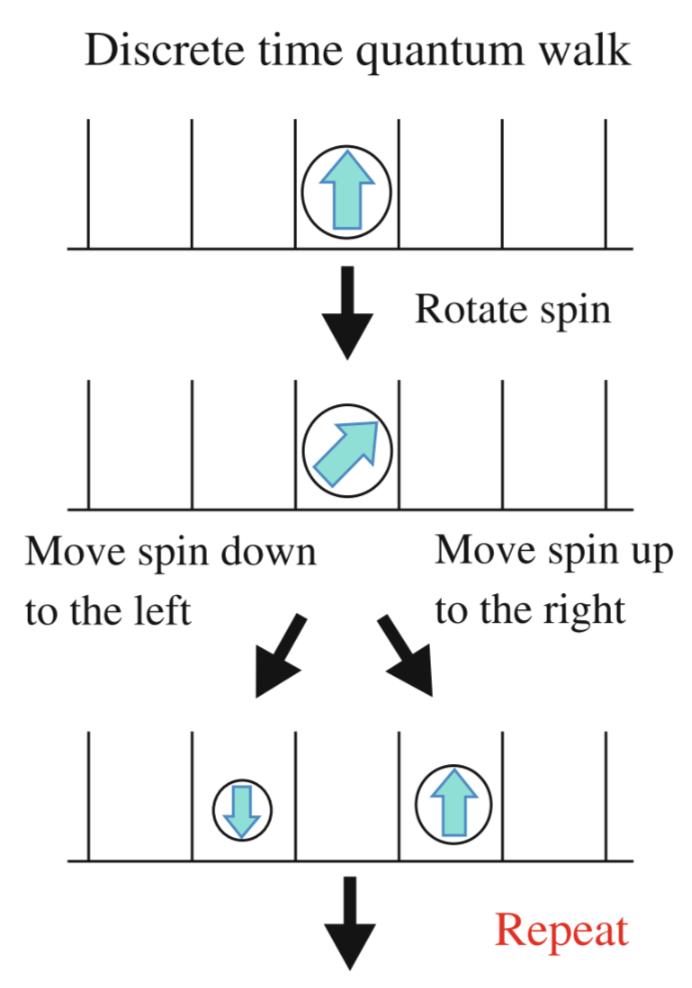
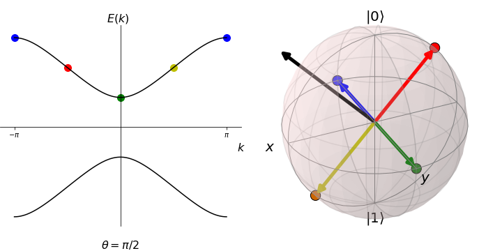
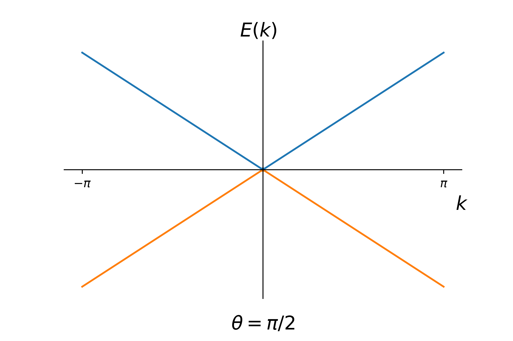
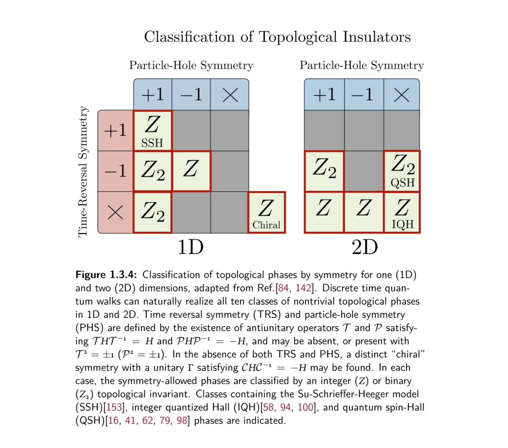

# Quantum random walk overview  
## Fundamentals of Quantum Walks  
量子行走的概念最早由Y. Aharonov, L. Davidovich and N. Zagury三位物理学家于1993年的一项工作中提出[1] ，量子行走分为离散(discrete)量子行走和连续(continuous)量子行走，两者间的主要区别为演化算符的选取，在离散量子行走中，相应的系统演化算符以离散的时间间隔作用于系统，而连续量子行走中，演化算符可以在任意时间作用于系统，其对应的模型为[2]：  
* The first model, called discrete quantum walks, consists of two quantum mechanical systems, named a walker and a coin, as well as an evolution operator which is applied to both systems only in discrete time steps. The mathematical structure of this model is evolution via unitary operator, i.e. $$\vert\Psi\rangle_{t_2}= \tilde{U}\vert\Psi\rangle_{t_1}$$   
* The second model, named continuous quantum walks, consists of a walker and an evolution (Hamiltonian) operator of the system that can be applied with no timing restrictions at all, i.e. the walker walks any time. The mathematical structure of this model is evolution via the Schr¨odinger equation.  
  
## One dimensional quantum walk  
一维量子行走(Discrete quantum walks on a line (DQWL))是量子行走的最简单模型，已经有大量研究，其描述了一个有两个内态自由度的粒子在一维晶格中运动，一维晶格可以为线形或环形。DQWL由两个子系统构成：coin和walker，$\mathcal{H}_P$为walker所在的有限维无穷希尔伯特空间，代表walker的位置$\vert j\rangle$，$\mathcal{H}_C$为coin所在的二维希尔伯特空间，代表coin的“正面$\vert\uparrow\rangle$”或“反面$\vert\downarrow\rangle$”。DQWL总系统的希尔伯特空间表示为$\mathcal{H}=\mathcal{H}_P\otimes\mathcal{H}_C$。系统的演化算符$U$包含有两个幺正操作[3, 4]，分别为：  
1. Rotation of the spin around y axis by angle $\theta$, corresponding to the operation  
$$  
R_y(\theta) = 
\begin{bmatrix}
    \cos (\theta/2) & -\sin(\theta/2)\\
    \sin(\theta/2) & cos(\theta/2)\\
\end{bmatrix}
=e^{−i\theta\sigma_y/2}
$$  
where $\sigma_y$ is a Pauli operator. The operator on the spatial degrees of freedom is identity, and we suppress this in the following.  
2. Spin-dependent translation T of the particle, where spin up particle is move to the right by one lattice site and spin down particle is moved to the left by one lattice site. Explicitly, $T =\sum_{j=-\infty}^{\infty}\vert j + 1\rangle\langle j \vert\otimes\vert ↑\rangle\langle \vert + \vert j − 1\rangle\langle j\vert\otimes\vert↓\rangle\langle↓ \vert$.  
  
  
由于$T$和$R(\theta)$是离散的幺正操作，系统的单步幺正演化算符$U(\theta)=TR(\theta)$又等效于一等效含时哈密顿(Floquet Hamiltonian)在单步操作的时间$\delta t$作用于系统：  
$$  
U(\theta)=e^{-iH(\theta)\delta t},\hbar=1
$$  
系统经过$n$步演的演化算符表示为$U^n(\theta)=e^{-iH(\theta)n\delta t}$，接下来的讨论中，我们假设$\delta t=1$。  
由于离散量子行走的转移不变性(translation invariant)，利用离散时间Fourier变换[2]  
$$  
    \vert k\rangle=\frac{1}{2\pi}\sum_xe^{-ikx}\vert x\rangle,-\pi\leq k\langle \pi
$$  
将转移算符$T$写为  
$$  
\begin{aligned}
    T &=\sum\limits_{j=-\infty}^{\infty}\vert j+1\rangle\langle j\vert\otimes\vert\uparrow\rangle\langle\uparrow\vert+\vert j−1\rangle\langle j\vert\otimes\vert\downarrow\rangle\langle\downarrow\vert \\
    &=\sum\limits_{k}e^{-ik\sigma_z}\otimes\vert k\rangle\langle k\vert
\end{aligned}
$$  
上面的式中我们看到，自旋$\sigma_z$表示的自旋转移算符与准动量$k$表示的轨道自由度混合到了一起，该自旋-轨道耦合是实现拓扑相的关键[4]。同时连续量子行走并不具有相类似的自旋-轨道耦合作用。  
由于系统拥有两个内部自由度，可以将$H(\theta)$写为二能带哈密顿  
$$  
    H(\theta)=\int\limits_{-\pi}^{\pi}dk[E_{\theta}(k)\mathbf{n}_{\theta}(k)\cdot \mathbf{\sigma}]\otimes\vert k\rangle\langle k\vert
$$  
其中$$\mathbf{\sigma}=(\sigma_x,\sigma_y,\sigma_z)$$为Pauli矩阵向量，单位向量$$\mathbf{n}_{\theta}(k)=(n_x,n_y,n_z)$$定义自旋本征态在动量$k$方向的量子化轴[4,5,6]。  
因为系统的演化是周期性的，因此相应的能带结构为$2\pi$周期的准能量谱。对于$\theta\neq 0\ or\ 2\pi$，$E_{\theta}(k)$和$\mathbf{n}_{\theta}(k)$  
$$  
\begin{aligned}
    & \cos E_{\theta}(k)=\cos(\theta/2)\cos k\\
    & \mathbf{n}_{\theta}(k)=\frac{[\sin(\theta/2)\sin k,\sin(\theta/2)\cos k,-\cos(\theta/2)\sin k]}{\sin E_{\theta}(k)}
\end{aligned}
$$  
  
当$\theta=0$或$2\pi$时，$H(\theta)$的能量谱没有能带间隙，并且当$k=0,\ \pi$时，$\sin E_{\theta}(k)$为零。  
  
## Toplogical Phase in 1D $\&$ 2D
...[6]
  
## Appendix A: The Bloch Sphere
An arbitrary single qubit state can be written:  
$$  
    \vert\phi\rangle=e^{i\gamma}\left(\cos \frac{\theta}{2}\vert0\rangle+e^{i\psi}\sin \frac{\theta}{2}\vert1\rangle\right)
$$  
where $\theta$, $\psi$ and $\phi$ are real numbers. The numbers $0\leq\theta\leq\pi$ and $0\leq\phi\leq$ define a point on a unit three-dimensional sphere. This is the Bloch sphere. Qubit states with arbitrary values of γ are all represented by the same point on the Bloch sphere because the factor of eiγ has no observable effects, and we can therefore choose to write:  
$$  
    \vert\psi\rangle=\cos \frac{\theta}{2}\vert0\rangle+e^{i\phi}\sin \frac{\theta}{2}\vert1\rangle
$$  
The rotation operators can be expanded as:  
$$  
\begin{aligned}
    & R_x(\theta)=e^{-i\frac{\theta}{2}}\sigma_x=\cos \frac{\theta}{2}I-i\sin \frac{\theta}{2}\sigma_x=    
    \begin{bmatrix}
        \cos (\theta/2) & -i\sin(\theta/2)\\
        -i\sin(\theta/2) & cos(\theta/2)\\
    \end{bmatrix}\\
    & R_y(\theta)=e^{-i\frac{\theta}{2}}\sigma_y=\cos \frac{\theta}{2}I-i\sin \frac{\theta}{2}\sigma_y= 
    \begin{bmatrix}
        \cos (\theta/2) & -\sin(\theta/2)\\
        \sin(\theta/2) & cos(\theta/2)\\
    \end{bmatrix}\\
    & R_z(\theta)=e^{-i\frac{\theta}{2}}\sigma_z=\cos \frac{\theta}{2}I-i\sin \frac{\theta}{2}\sigma_z= 
    \begin{bmatrix}
        e^{-i\theta/2} & 0\\
        0 & e^{i\theta/2}\\
    \end{bmatrix}\\
\end{aligned}  
$$  

## Appendix B: Discrete Time Fourier Transform[2]
Discrete Time Fourier Transform. Let $f : \mathbb{Z} → \mathbb{C}$ be a complex function over the integers $\Rightarrow$ its Discrete Time Fourier Transform (DTFT) $f:[−\pi, \pi] → \mathbb{C}$ is given by  
$$ 
\tilde{f}= \tilde{f}(e^{i\omega}) = \sum\limits_{n=-\infty}^{\infty}f(n)e^{-in\omega}
$$  
and its inverse is given by  
$$  
f(n)=\frac{1}{2\pi}\int_{-\pi}^{\pi}F(e^{i\omega})e^{in\omega}d\omega
$$  
deriving equ(2) with steps  
$$  
\begin{aligned}
    \vert k\rangle&=\frac{1}{\sqrt{2\pi}}\sum_xe^{-ikx}\vert x\rangle,
    \vert x\rangle=\frac{1}{\sqrt{2\pi}}\sum_xe^{ikx}\vert k\rangle
    ,-\pi\leq k\langle \pi;\\
    \langle k\vert &=\frac{1}{\sqrt{2\pi}}\sum_xe^{ikx}\langle x\vert,
    \langle x\vert=\frac{1}{\sqrt{2\pi}}\sum_xe^{-ikx}\langle k\vert,
    -\pi\leq k\langle \pi
\end{aligned}  
$$  
$$  
\begin{aligned}
    \sum\limits_{x}\vert x-1\rangle\langle x\vert &=\sum\limits_{x}\sum\limits_{k}e^{ik(x-1)}\vert k\rangle\langle x\vert\\
    &=\sum\limits_{k}e^{-ik}\vert k\rangle\sum\limits_{x}e^{ikx}\langle x\vert\\
    &=\sum\limits_{k}e^{-ik}\vert k\rangle\langle k\vert\\
    \sum\limits_{x}\vert x+1\rangle\langle x\vert &=\sum\limits_{x}\sum\limits_{k}e^{ik(x+1)}\vert k\rangle\langle x\vert\\
    &=\sum\limits_{k}e^{ik}\vert k\rangle\sum\limits_{x}e^{ikx}\langle x\vert\\
    &=\sum\limits_{k}e^{ik}\vert k\rangle\langle k\vert
\end{aligned}  
$$  

## References  
1. Yakir Aharonov, Luiz Davidovich, and Nicim Zagury. Quantum random walks. Physical Review A, 48(2):1687, 1993.  
2. Salvador Elías Venegas-Andraca. Quantum walks: a comprehensive review. Quantum Information Processing, 11(5):1015–1106, 2012.
3. Julia Kempe. Quantum random walks: an introductory overview. Contemporary Physics, 44(4):307–327, 2003.  
4. Takuya Kitagawa. Topological phenomena in quantum walks: elementary introduction to the physics of topological phases. Quantum Information Processing, 11 (5):1107–1148, 2012.  
5. Takuya Kitagawa, Erez Berg, Mark Rudner, and Eugene Demler. Topological characterization of periodically driven quantum systems. Physical Review B, 82 (23):235114, 2010.  
6. Takuya Kitagawa, Mark S Rudner, Erez Berg, and Eugene Demler. Exploring topological phases with quantum walks. Physical Review A, 82(3):033429, 2010.  
  