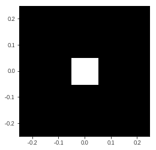
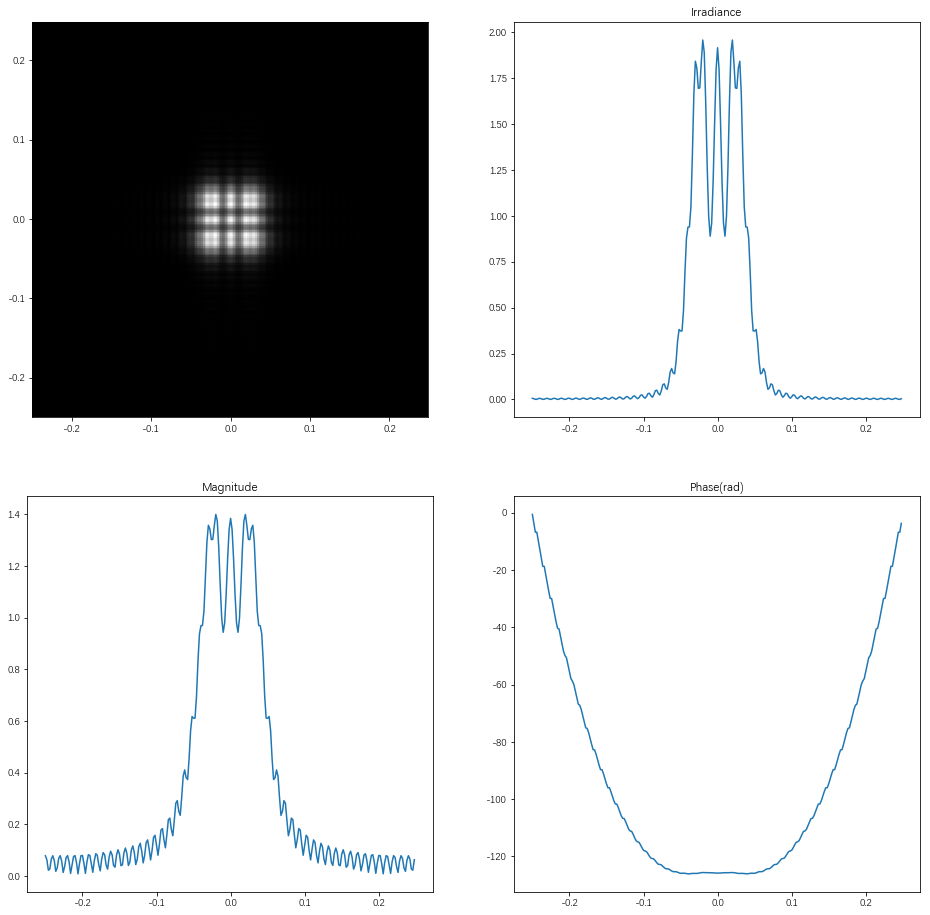
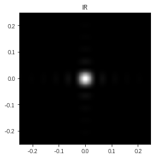
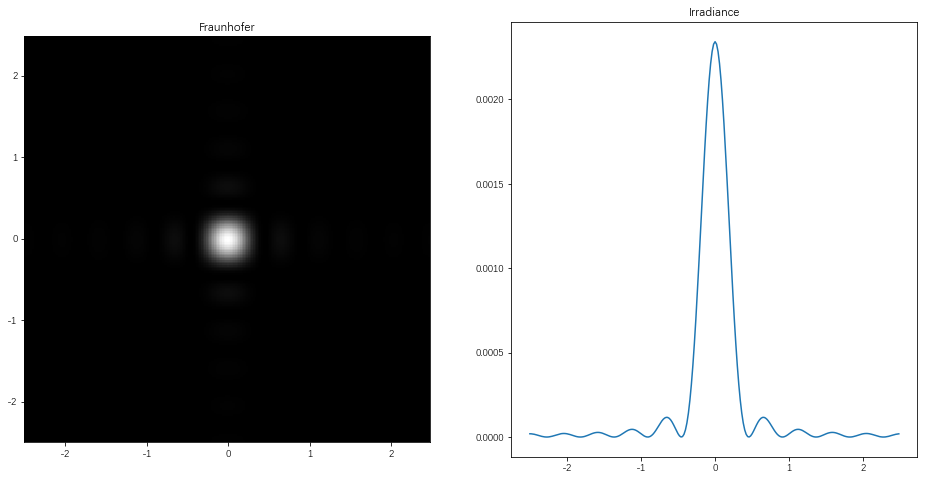
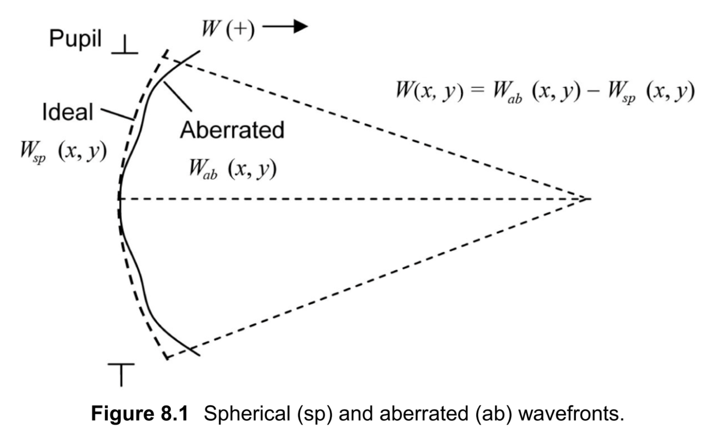
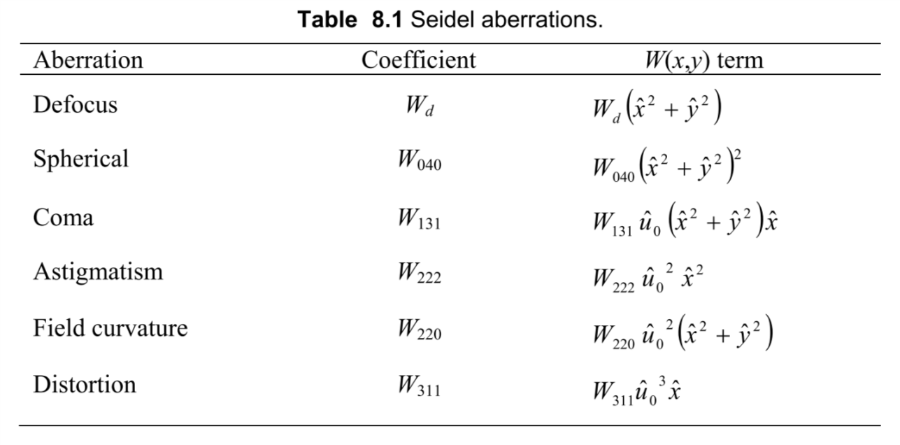
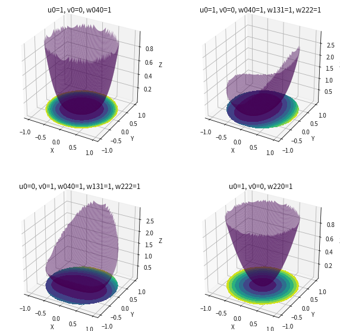
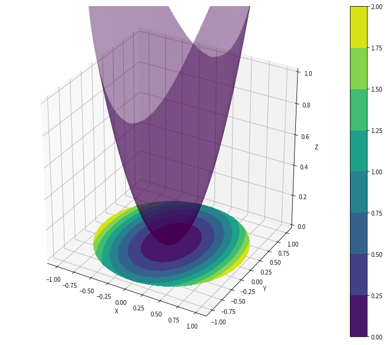

VOELZ, David George. Computational fourier optics: a MATLAB tutorial. Bellingham, WA: SPIE press, 2011.


```python
%matplotlib inline
import numpy as np
import matplotlib.pyplot as plt
```

Fresnel Transfer Function (TF) Propagator  
  
$U_2(x,y)=\mathscr{F}^{-1}\big\{\mathscr{F}\big\{U_1(x,y)\big\}H(f_X,f_Y)\big\}$  
  
The trasfer function is   
  
$H(f_X,f_Y)=e^{jkz}exp\big[-j\pi\lambda z(f_x^2+f_Y^2)\big]$


```python
def FresnelPropTF(u1, L, wavelength, z):
    """
    propagation : transfer function approach assumes same x and y side lengths and uniform sampling. 
    
    @param u1 : source plane field
    @param L : source and observation plane side length
    @param z : propagation distance
    
    return u2 : observation plane field
    """
    m, n = u1.shape
    dx = L/m
    k = 2*np.pi/wavelength
    
    fx = np.arange(-1/(2*dx), 1/(2*dx), 1/L)
    Fx, Fy = np.meshgrid(fx, fx)
    
    H = np.exp(-1j*np.pi*wavelength*z*(Fx**2+Fy**2))
    H = np.fft.fftshift(H)
    
    u2 = np.fft.ifftshift(np.fft.ifft2(np.fft.fft2(np.fft.fftshift(u1))*H))
    
    return u2
```

Fresnel Impulse Response (IR) Propagator  
  
$U_2(x,y)=\mathscr{F}^{-1}\big\{\mathscr{F}\big\{U_1(x,y)\big\}\mathscr{F}\big\{h(x,y)\big\}\big\}$  

The impulse response h is  
  
$h(x,y)=\frac{e^{jkz}}{j\lambda z}exp\big[\frac{jk}{2z}(x^2+y^2)\big]$


```python
def FresnelPropIR(u1, L, wavelength, z):
    """
    propagation : impulse response approach assumes same x and y side lengths and uniform sampling. 
    
    @param u1 : source plane field
    @param L : source and observation plane side length
    @param z : propagation distance
    
    return u2 : observation plane field
    """
    m, n = u1.shape
    dx = L/m
    k = 2*np.pi/wavelength
    
    x = np.arange(-L/2, L/2, dx)
    X, Y = np.meshgrid(x, x)
    
    h = 1/(1j*wavelength*z)*np.exp(1j*k/(2*z)*(X**2+Y**2))
    H = np.fft.fft2(np.fft.fftshift(h))*dx**2
    u2 = np.fft.ifftshift(np.fft.ifft2(np.fft.fft2(np.fft.fftshift(u1))*H))
    
    return u2
```

Fraunhofer Propagation
  
$U_2(x_2,y_2)=\frac{exp(jkz)}{jkz}exp\big[j\frac{k}{2z}(x_2^2+y_2^2)\big]\iint U_1(x_1,y_1)exp\big[-j\frac{2\pi}{\lambda z}(x_2x_1+y_2y_1)\big]dx_1dy_1$  


```python
def FraunhoferProp(u1, L1, wavelength, z):
    """
    propagation : Fraunhofer pattern assumes uniform sampling. 
    
    @param u1 : source plane field
    @param L : source plane side length
    @param z : propagation distance
    
    return L2 : observation plane side length
    return u2 : observation plane field
    """
    m, n = u1.shape
    dx1 = L1/m
    k = 2*np.pi/wavelength
    
    L2 = wavelength*z/dx1
    dx2 = wavelength*z/L1
    x2 = np.arange(-L2/2, L2/2, dx2)
    X2, Y2 = np.meshgrid(x2, x2)
    
    c = 1/(1j*wavelength*z)*np.exp(1j*k/(2*z)*(X2**2+Y2**2))
    u2 = c*np.fft.ifftshift(np.fft.fft2(np.fft.fftshift(u1)))*dx1**2
    
    return u2, L2
```

Rect function


```python
def rect(x):
    return np.where(np.abs(x)<=0.5, 1, 0)
```

Square Beam Example


```python
L1 = 0.5 # side length
M = 250 # number of samples
dx1 = L1/M # scr sample interval
x1 = np.arange(-L1/2, L1/2, dx1) # src coords
y1 = x1

wavelength = 0.5*10e-6 # wavelength
k = 2*np.pi/wavelength # wavenumber
w = 0.051 # source half width in meter
z = 200 # propagation distance in meter

X1, Y1 = np.meshgrid(x1, y1)

u1 = rect(X1/(2*w))*rect(Y1/(2*w)) # src feild
I1 = np.abs(u1**2) # src irradiance

extent = np.min(x1), np.max(x1), np.min(y1), np.max(y1)
plt.imshow(I1, extent=extent, cmap='gray')
```





```python
u2 = FresnelPropTF(u1, L1, wavelength, z)

x2 = x1
y2 = y1

I2 = np.abs(u2**2)

plt.figure(figsize=(16,16))

plt.subplot(221)
extent = np.min(x2), np.max(x2), np.min(y2), np.max(y2)
plt.imshow(I2, extent=extent, cmap='gray')

plt.subplot(222)
plt.plot(x2, I2[M//2])
plt.title('Irradiance')

plt.subplot(223)
plt.plot(x2, np.abs(u2[M//2]))
plt.title('Magnitude')

plt.subplot(224)
plt.plot(x2, np.unwrap(np.angle(u2[M//2])))
plt.title('Phase(rad)')
```





```python
u2 = FresnelPropIR(u1, L1, wavelength, z)

x2 = x1
y2 = y1

I2 = np.abs(u2**2)

extent = np.min(x2), np.max(x2), np.min(y2), np.max(y2)
plt.imshow(I2, extent=extent, cmap='gray')
plt.title('IR')
```





```python
w = 0.011
u1 = rect(X1/(2*w))*rect(Y1/(2*w))

u2, L2 = FraunhoferProp(u1, L1, wavelength, z=2000)

dx2 = L2/M
x2 = np.arange(-L2/2, L2/2, dx2)
y2 = x2

I2 = np.abs(u2**2)

plt.figure(figsize=(16,8))

plt.subplot(121)
extent = np.min(x2), np.max(x2), np.min(y2), np.max(y2)
plt.imshow(I2, extent=extent, cmap='gray')
plt.title('Fraunhofer')

plt.subplot(122)
plt.plot(x2, I2[M//2])
plt.title('Irradiance')
```





## Wavefront Aberration  
The wavefront error is described by W(x,y), an optical path difference (OPD) function that represents the difference between the spherical and aberrated wavefront surfaces. x and y are coordinates in the pupil plane.  
$W(x,y)=W_{ab}(x,y)-W_{sp}(x,y)$  
  
Seidel polynomials are often used to describe monochromatic aberrations for rotationally symmetric optical systems, such as most lenses and mirrors. A common form that is applied in conventional imaging systems is described by  
$W(\hat{u};\rho,\theta)=\sum\limits_{j,m,n}W_{k l m}\hat{u}^k\rho^lcos^m\theta;k=2j+m,l=2n+m$  
where $\rho$ is a normalized radial distance in the XP and $\rho$ is the angle in the XP. The normalized XP has a radius of 1 where the physical coordinates (x, y) are divided by the XP radius to get normalized coordinates
$(\hat{x}, \hat{y})$. $\hat{u}_0$is a fractional image height, or normalized image height, defined along the $\hat{u}$ axis in the imaging plane. The fractional image height is the physical height of a given point in the image divided by the maximum image radius being considered.  
For simulation purposes it is convenient to convert from polar to Cartesian coordinates.  
$\rho=\sqrt{\hat{x}^2+\hat{y}^2}$ and $\rho cos\theta=\hat{x}$  
and the primary aberration are then written  
$W(\hat{u}_0;\hat{x},\hat{y})=W_d(\hat{x}^2+\hat{y}^2)+W_{040}(\hat{x}^2+\hat{y}^2)^2+W_{131}\hat{u}_0(\hat{x}^2+\hat{y}^2)\hat{x}+W_{222}\hat{u}_0^2\hat{x}^2+W_{220}\hat{u}_0^2(\hat{x}^2+\hat{y}^2)+W_{311}\hat{u}_0^3\hat{x}$  
  
  
|Aberration|Coefficient|   $W(x,y)$ term   |
|:-:|:-:|:-:|
|Defous|$W_d$|$W_d(\hat{x}^2+\hat{y}^2)$|
|Spherial|$W_{040}$|$W_{040}(\hat{x}^2+\hat{y}^2)^2$|
|Coma|$W_{131}$|$W_{131}\hat{u}_0(\hat{x}^2+\hat{y}^2)$|
|Astigmatism|$W_{222}$|$W_{222}\hat{u}_0^2\hat{x}^2$|
|Field curvature|$W_{220}$|$W_{220}\hat{u}_0^2(\hat{x}^2+\hat{y}^2)$|
|Distortion|$W_{311}$|$W_{311}\hat{u}_0^3\hat{x}$|


```python
def seidel_5(u0, v0, X, Y, wd, w040, w131, w222, w220, w311):
    """
    seidel_5 : Compute wavefront OPD for firt 5 Seidel wavefront aberration cofficients + defocus
    
    u0, v0 : normalized image plane coordinate
    X, Y : normalized pupil coordinate arrays (like from meshgrid)
    wd : defocus
    w040 : sphererical
    w131 : coma
    w222 : astigmatism
    w220 : field curvature
    w311 : distortion
    """
    
    beta = np.arctan2(v0, u0) # image rotation angle
    u0r = np.sqrt(u0**2+v0**2) # image height
    
    # rotate grid
    Xr = X*np.cos(beta)+Y*np.sin(beta)
    Yr = -X*np.sin(beta)+Y*np.cos(beta)
    
    # Seidel polynomials
    rho2 = Xr**2+Yr**2
    w = wd*rho2+w040*rho2**2+w131*u0r*rho2*Xr+w222*u0r**2*Xr**2+w220*u0r**2*rho2+w311*u0r**3*Xr
    
    return w
```


```python
def circ(r):
    """
    Circle function
    
    """
    
    return np.where(np.abs(r)<=1, 1, 0)
```


```python
from matplotlib import cm
from mpl_toolkits.mplot3d import Axes3D

fig = plt.figure(figsize=(10, 10))

ax = fig.add_subplot(2, 2, 1, projection='3d')

u0 = 1
v0 = 0
X, Y = np.meshgrid(np.linspace(-1, 1, 100), np.linspace(-1, 1, 100))
wd, w040, w131, w222, w220, w311 = [0, 1, 0, 0, 0, 0]
w = seidel_5(u0, v0, X, Y, wd, w040, w131, w222, w220, w311)
P = circ(np.sqrt(X**2+Y**2))
mask = np.where(P==0)
w[mask] = np.nan

cset = ax.contourf(X, Y, w, zdir='z', offset=0, cmap=cm.viridis)
ax.plot_surface(X, Y, w, rstride=1, cstride=1, alpha=0.5, cmap=cm.viridis)

ax.set_title('u0=1, v0=0, w040=1')

ax.set_xlabel('X')
ax.set_ylabel('Y')
ax.set_zlabel('Z')

ax = fig.add_subplot(2, 2, 2, projection='3d')

u0 = 1
v0 = 0
X, Y = np.meshgrid(np.linspace(-1, 1, 100), np.linspace(-1, 1, 100))
wd, w040, w131, w222, w220, w311 = [0, 1, 1, 1, 0, 0]
w = seidel_5(u0, v0, X, Y, wd, w040, w131, w222, w220, w311)
P = circ(np.sqrt(X**2+Y**2))
mask = np.where(P==0)
w[mask] = np.nan

cset = ax.contourf(X, Y, w, zdir='z', offset=0, cmap=cm.viridis)
ax.plot_surface(X, Y, w, rstride=1, cstride=1, alpha=0.5, cmap=cm.viridis)

ax.set_title('u0=1, v0=0, w040=1, w131=1, w222=1')

ax.set_xlabel('X')
ax.set_ylabel('Y')
ax.set_zlabel('Z')

ax = fig.add_subplot(2, 2, 3, projection='3d')

u0 = 0
v0 = 1
X, Y = np.meshgrid(np.linspace(-1, 1, 100), np.linspace(-1, 1, 100))
wd, w040, w131, w222, w220, w311 = [0, 1, 1, 1, 0, 0]
w = seidel_5(u0, v0, X, Y, wd, w040, w131, w222, w220, w311)
P = circ(np.sqrt(X**2+Y**2))
mask = np.where(P==0)
w[mask] = np.nan

cset = ax.contourf(X, Y, w, zdir='z', offset=0, cmap=cm.viridis)
ax.plot_surface(X, Y, w, rstride=1, cstride=1, alpha=0.5, cmap=cm.viridis)

ax.set_title('u0=0, v0=1, w040=1, w131=1, w222=1')

ax.set_xlabel('X')
ax.set_ylabel('Y')
ax.set_zlabel('Z')

ax = fig.add_subplot(2, 2, 4, projection='3d')

u0 = 1
v0 = 0
X, Y = np.meshgrid(np.linspace(-1, 1, 100), np.linspace(-1, 1, 100))
wd, w040, w131, w222, w220, w311 = [0, 0, 0, 0, 1, 0]
w = seidel_5(u0, v0, X, Y, wd, w040, w131, w222, w220, w311)
P = circ(np.sqrt(X**2+Y**2))
mask = np.where(P==0)
w[mask] = np.nan

cset = ax.contourf(X, Y, w, zdir='z', offset=0, cmap=cm.viridis)
ax.plot_surface(X, Y, w, rstride=1, cstride=1, alpha=0.5, cmap=cm.viridis)

ax.set_title('u0=1, v0=0, w220=1')

ax.set_xlabel('X')
ax.set_ylabel('Y')
ax.set_zlabel('Z')
```





```python
fig = plt.figure(figsize=(12, 10))

ax = fig.gca(projection='3d')

u0 = 1
v0 = 0
X, Y = np.meshgrid(np.linspace(-1, 1, 512), np.linspace(-1, 1, 512))
wd, w040, w131, w222, w220, w311 = [1, 0, 0, 1, 0, 0]
w = seidel_5(u0, v0, X, Y, wd, w040, w131, w222, w220, w311)
P = circ(np.sqrt(X**2+Y**2))
mask = np.where(P==0)
w[mask] = np.nan

cset = ax.contourf(X, Y, w, zdir='z', offset=0, cmap=cm.viridis)
# ax.plot_surface(X, Y, w, rstride=1, cstride=1, alpha=0.5, cmap=cm.viridis, antialiased=False)
ax.plot_surface(X, Y, w, rstride=1, cstride=1, alpha=0.5, cmap=cm.viridis)

ax.set_zlim(0, 1)

# ax.set_title('u0=1, v0=0, wd=1, w222=1')

# ax.set_title('眼睛散光模型')

ax.set_xlabel('X')
ax.set_ylabel('Y')
ax.set_zlabel('Z')

fig.colorbar(cset)

fig=plt.gcf()
fig.savefig('眼睛散光模型.png', dpi=600)

plt.show()
```


