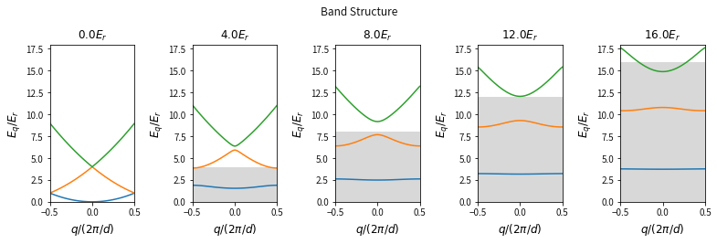
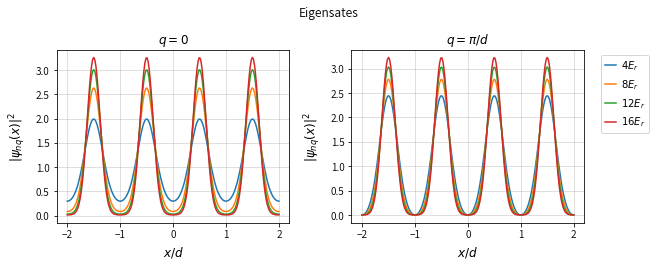
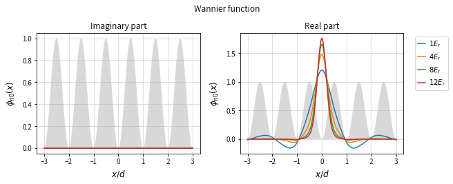
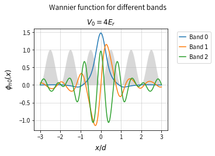

# Wannier function  

```python
import numpy as np
import matplotlib.pyplot as plt
import sympy as sym

from matplotlib.gridspec import GridSpec
from qutip import *
```

## Bloch functions and Wannier functions  
Bloch functions are eigenstates of Schrodinger equation with a periodic potential  
$$
\psi _{n\mathbf {k} }(\mathbf {r} )=e^{i\mathbf {k} \cdot \mathbf {r} }u_{n\mathbf {k} }(\mathbf {r} )
$$
where $n$ is the band index and $\mathbf{k}$ is wave vector. $u_{n\mathbf{k}}(\mathbf{r})$ has the same periodicity as the potential. Bloch functions are peroiodic functions of reciprocal lattice vector  
$$
\psi_{n\mathbf{k}}(\mathbf{r})=\psi_{n\mathbf{k+K}}(\mathbf{r})
$$
Then we introduce the maximally localized wave packet Wannier functions which are defined by the Fourier transform of Bloch functions 
$$
\phi _{{{n\mathbf  {R}}}}({\mathbf  {r}})={\frac  {1}{{\sqrt  {N}}}}\sum _{{{\mathbf  {k}}}}e^{{-i{\mathbf  {k}}\cdot {\mathbf  {R}}}}\psi _{{{n\mathbf  {k}}}}({\mathbf  {r}})
$$
where $\mathbf{R}$ is any lattice vector, $N$ is the number of primitive cells in the crystal,  and the sum on $\mathbf{k}$ includes all the values of k in the Brillouin zone.  
Wannier functions only depend on the quantity of position $\mathbf{r}-\mathbf{R}$ and peroiodic functions of any lattice vector $\mathbf{R}^{\prime}$  
$$
\phi _{{{n}}}({\mathbf  {r}-\mathbf  {R}})\equiv\phi _{{{n\mathbf  {R}}}}({\mathbf  {r}})=\phi _{{{n\mathbf  {R}}+{\mathbf  {R}}'}}({\mathbf  {r}}+{\mathbf  {R}}')
$$
They are not the eigenstates of Schrodinger equation with a periodic potential.  

## One-dimentional optical lattice potential  
We simply discuss the one dimensional sinusoidal periodic potential with the Hamiltonian  
$$
H=-\frac{\hbar^{2}}{2m}\frac{\partial^{2}}{\partial x^{2}}+V_{0}\cos^{2}{(kx)}
$$
where $k=2\pi/\lambda=\pi/d$ with the space periodicity of the potential $d=\lambda/2$. In the case of optical lattice, we define the potential depth $V_{0}$ as the form of $sE_{r}$, where $E_{r}=\frac{\hbar^{2}k^{2}}{2m}$ is the recoil energy.  
The Bloch function solutions of the Hamiltonian have the form  
$$
\varphi_{nq}=e^{iqx}u_{nq}(x)
$$
which labeled by the quasimomentum $q$ and band index $n$. $u_{nq}(x)$ has the same periodicity as the potential with $d$, i.e., $u_{nq}(x+d)=u_{nq}(x)$. The Fourier transform of wave function and the potential, with the reciprocal-lattice vector defined by $G=2\pi/d$
$$
\begin{aligned}
\psi_{nq}(x)&=e^{i q x} \sum_{l} c_{l}^{n} e^{i l G x}\\
V(x)&=\sum_{l} V_{l} e^{i l G x}
\end{aligned}
$$
Putting into the Schrodinger equation, we get  
$$
\begin{aligned}
H\psi_{nq}(x)&=\sum_{l}\left[\frac{\hbar^{2}}{2m}(q+lG)^{2}+\left(V_{-1}e^{-iGx}+V_{l=0}e^{0}+V_{1}e^{iGx}\right)\right]c_{l}^{n}e^{i(q+lG)x}\\
&=\sum_{l}\left\{\left[\frac{\hbar^{2}}{2m}(q+lG)^{2}+\frac{V_{0}}{2}\right]c_{l}^{n}+\frac{V_{0}}{4}\left(c_{l-1}^{n}+c_{l+1}^{n}\right)\right\}e^{i(q+lG)x}\\
&=E_{r}\sum_{l}\left\{\left[\frac{1}{k^{2}}(q+lG)^{2}+\frac{v_{0}}{2}\right]c_{l}^{n}+\frac{v_{0}}{4}\left(c_{l-1}^{n}+c_{l+1}^{n}\right)\right\}e^{i(q+lG)x}\\
&=E_{r}\sum_{l}\left\{\left[(q/k+2l)^{2}+\frac{v_{0}}{2}\right]c_{l}^{n}+\frac{v_{0}}{4}\left(c_{l-1}^{n}+c_{l+1}^{n}\right)\right\}e^{i(q+2lk)x}\\
&=E_{nq}\psi_{nq}(x)
\end{aligned}
$$
in which, $V_{l=0}=V_{0}/2$ and $V_{\pm 1}=V_{0}/4$, $v_{0}=V_{0}/E_{r}$. This is a series of linear equations  
$$
\left[4(\frac{q}{2k}+l)^{2}+\frac{v_{0}}{2}\right]c_{l}^{n}+\frac{v_{0}}{4}\left(c_{l-1}^{n}+c_{l+1}^{n}\right)=\varepsilon_{nq} c_{l}^{n}
$$
where $\varepsilon_{nq}=E_{nq}/E_{r}$


```python
def H0_cos(Npoints, q, v0):
    return np.diag(4*(q+np.arange(-Npoints, Npoints+1))**2+v0/2, 0)+np.diag(v0/4*np.ones(2*Npoints), 1)+np.diag(v0/4*np.ones(2*Npoints), -1)
```


```python
def H0_sin(Npoints, q, v0):
    return np.diag(4*(q+np.arange(-Npoints, Npoints+1))**2+v0/2, 0)+np.diag(-v0/4*np.ones(2*Npoints), 1)+np.diag(-v0/4*np.ones(2*Npoints), -1)
```


```python
q, v0 = sym.symbols("q V_{0}")
sym.Matrix(H0_cos(2, q, v0))
```


$\displaystyle \left[\begin{matrix}\frac{V_{0}}{2} + 4 \left(q - 2\right)^{2} & 0.25 V_{0} & 0 & 0 & 0\\0.25 V_{0} & \frac{V_{0}}{2} + 4 \left(q - 1\right)^{2} & 0.25 V_{0} & 0 & 0\\0 & 0.25 V_{0} & \frac{V_{0}}{2} + 4 q^{2} & 0.25 V_{0} & 0\\0 & 0 & 0.25 V_{0} & \frac{V_{0}}{2} + 4 \left(q + 1\right)^{2} & 0.25 V_{0}\\0 & 0 & 0 & 0.25 V_{0} & \frac{V_{0}}{2} + 4 \left(q + 2\right)^{2}\end{matrix}\right]$


```python
def eigenvalsH0(q, v0, NPoints=5):
    '''
    Calculate eigen energy in 1D lattice
    '''
    h0 = H0_cos(Npoints, q, v0)
    return np.sort(np.linalg.eigvalsh(h0))
```


```python
def eigenfunsH0(q, v0, x, NPoints=5):
    '''
    Calculate eigenfunctions in 1D lattice
    '''
    h0 = H0_cos(Npoints, q, v0)
    eigenvals, eigenvects = np.linalg.eigh(h0)
    eigenvals = np.sort(eigenvals)
    vectsort = np.argsort(eigenvals)
    eigenvects = eigenvects[vectsort]
    
    a = 1.0 # We use x in units of the lattice spacing
    k = np.pi/a
    
    l = np.arange(-Npoints, Npoints+1)
    
    psi = np.exp(1j*q*x) * (eigenvects[:, 0] @ np.exp(1j*(2*k)*np.outer(l, x)))
    
    phase = np.exp(0)
    
    return psi
```


```python
def bandH0(NBand, qs, v0, NPoints=5):
    '''
    Version of eigenvalsH0 that works with an array input for q
    '''
    
    Eq = np.array([eigenvalsH0(q, v0, NPoints=NPoints)[NBand] for q in qs])
    return Eq
```


```python
def hosc(NBand, v0):
    '''
    Energy of the NBand^th h.o. state in a lattice with depth v0
    '''
    return 2*np.sqrt(v0)*(NBand + 0.5)
```

### Band structure


```python
depths = [0., 4., 8., 12., 16.]
qs = np.linspace(-0.5, 0.5, 101)

fig = plt.figure(constrained_layout=True, figsize=(2.16*len(depths), 3.6))
gs = GridSpec(1, len(depths), figure=fig)
plt.suptitle('Band Structure')

for i, d in enumerate(depths):
    ax = fig.add_subplot(gs[0, i])
    
    ax.fill_between(qs, 0., d, facecolor='gray', alpha=0.3)
    
    ax.plot(qs, bandH0(0, qs, d, NPoints=5))
    ax.plot(qs, bandH0(1, qs, d, NPoints=5))
    ax.plot(qs, bandH0(2, qs, d, NPoints=5))
    
    ax.set_xlabel(r'$q / (2\pi/d)$', fontsize=12)
    ax.set_ylabel(r'$E_{q} / E_{r} $', fontsize=12)
    ax.set_title(r'$%.1f E_{r}$'%d, fontsize=12)
    ax.set_xlim(-0.5, 0.5)
    ax.set_ylim(0., 18.)
```





### Bloch function


```python
depths = [4., 8., 12., 16.]

fig = plt.figure(constrained_layout=True, figsize=(9, 3.6))
gs = GridSpec(1, 2, figure=fig)
plt.suptitle('Eigensates')

ax0 = fig.add_subplot(gs[0, 0])
ax1 = fig.add_subplot(gs[0, 1])

for ax in [ax0, ax1]:
    ax.set_xlabel(r'$x/d$', fontsize=12)
    ax.set_ylabel(r'$|\psi_{nq}(x)|^{2}$', fontsize=12, rotation=90, labelpad=8)
    ax.set_xticks([-2, -1, 0, 1, 2])
    ax.grid(alpha=0.5)
ax0.set_title(r'$q = 0 $', fontsize=12)
ax1.set_title(r'$q = \pi/d$', fontsize=12)

qbot = 0.
qtop = 0.5

x = np.linspace(-2, 2, 200)

for i, d in enumerate(depths):
    ax0.plot(x, np.abs(eigenfunsH0(qbot, d, x, NPoints=5))**2)
    ax1.plot(x, np.abs(eigenfunsH0(qtop, d, x, NPoints=5))**2, label=r'$%.1d E_{r}$'%d)
    
plt.legend( bbox_to_anchor=(1.05,1.00), loc='upper left', numpoints=1, prop={'size':10}, handlelength=1.1, handletextpad=0.5 )
```





### Wannier function

We can see, in the regime where called tight-binding regime, the Bloch wavepackets strongly localize in the deep potential. Here we introduce a series site localized complete orthogonal sets Wannier functions to represent the wavepacket  
$$
\psi_{nq}(x)=\frac{1}{\sqrt{N}}\sum_{j=0}^{N-1}\alpha_{j}\phi_{n}(x-x_{j})
$$
The Bloch wavefunction stay invriant by a translation of lattice site $d$, the wavefunction can only be multiplied by a phase by a translation
$$
\psi(x+a)=e^{iqd}\psi(x)
$$
where $q$ is the quasimomentum. The Bloch theorm above determines the coefficets $\alpha_{j}$ and gives
$$
\psi_{nq}(x)=\frac{1}{\sqrt{N}}\sum_{j=0}^{N-1}e^{iqx_{j}}\phi_{n}(x-x_{j})
$$
Since $x_{j} = dj$, values of $q$ differing by $2\pi/d$ would lead to the same coefficients. We must therefore restrict the values of $q$ to an interval of size $2\pi/d$, called the first Brillouin zone. Typically, one takes $q\in[−\pi/d, \pi/d]$. All physical quantities are thus periodic over this interval. In addition, not all values of $q$ are allowed. Because the system is of size $N$, $q$ must be quantized. The precise quantization depends on the boundary conditions. For example, for periodic boundary conditions, $\psi(x+Ld)=\psi(x)$ imposes that $q$ is a multiple of an integer:
$$
q=\frac{2\pi m}{N},\quad m=0, 1, \cdots, N-1
$$
The Wannier functions is then given by  
$$
\begin{aligned}
\phi_{n}(x-x_{j})\equiv\phi_{nj}(x)&=\frac{1}{\sqrt{N}}\sum_{q}e^{-iqx_{j}}\psi_{nq}(x)\\
&=\frac{1}{\sqrt{N}}\sum_{q}\sum_{l}c_{ql}^{n}e^{-iqx_{j}}e^{i(q+2lk)x}\\
&=\frac{1}{\sqrt{N}}\sum_{\xi}\sum_{l}c_{\xi l}^{n}e^{-i\xi j}e^{i2\pi(\xi+l)\chi}
\end{aligned}
$$
where $\xi=q/2k$ and $\chi=x/d$. Then we set $x_{j} = 0$ for the calculation of the Wannier function, other states centered at different lattice sites can be obtained by translation of the $x_{j}=0$ centered state.
$$
\phi_{n0}(x)=\frac{1}{\sqrt{N}}\sum_{\xi}\sum_{l}c_{\xi l}^{n}e^{i2\pi(\xi+l)\chi}
$$
Because of the parity of Hamiltonian, the wave functions should be the form of $\psi_{nq}(-x)=\pm\psi_{nq}(x)$, which implies that $c_{\xi l}^{n}=\pm c_{\xi^{\prime}l^{\prime}}^{n}$ if $(\xi+l)=-(\xi^{\prime}+l^{\prime})$. Thus, the Wannier function is given by  
$$
\phi_{n0}(\chi)=\frac{1}{\sqrt{N}}\left(\overset{\xi+l=0}{\sum_{\xi}\sum_{l}}c_{\xi l}^{n}+\overset{\xi+l>0}{\sum_{\xi} \sum_{l}} c_{\xi l}^{n}\left[e^{i 2 \pi(\xi+l) \chi} \pm e^{-i 2 \pi(\xi+l) \chi}\right]\right)
$$
It is shown that the maximally localized Wannier states are obtained if the plus sign is chosen for even bands and the minus sign is chosen for odd bands. So, the $x_{j} = 0$ Wannier state is symmetric for the even bands and antisymmetric for the odd bands.
$$
\phi_{n0}(\chi)=\frac{1}{\sqrt{N}}\overset{\xi+l=0}{\sum_{\xi}\sum_{l}}c_{\xi l}^{n}+\frac{2}{\sqrt{N}} \overset{\xi+l>0}{\sum_{\xi} \sum_{l}} c_{\xi l}^{n}\left\{\begin{array}{ll}
\cos [2 \pi(\xi+l) \chi] & \text { if } n \text { even } \\
\sin [2 \pi(\xi+l) \chi] & \text { if } n \text { odd }
\end{array}\right.
$$


```python
def wannier(x, v0, band=0):
    N = 200. # Lattice size
    qset = np.arange(0, N)/N
    qsetSize = len(qset)
    
    num_l = 20  # Number of plane waves 
    lset = np.arange(-num_l, num_l+1)
    lsetSize = len(lset)
    
    # Diagonalize for all values of q
    cCoefs = np.empty((qsetSize, lsetSize, lsetSize))
    for qi, q in enumerate(qset):
        h0 = H0_sin(num_l, q, v0)
        eigenvals, eigenvects =  np.linalg.eigh(h0)
        for j in np.arange(lsetSize):
            if eigenvects[:, j][-1] > 0 :
                cCoefs[qi][j] = eigenvects[:, j]/np.sqrt(N) # 1/np.sqrt(N) is the normalization factor
            else:
                cCoefs[qi][j] = -1.*eigenvects[:, j]/np.sqrt(N)
                
    #Calculate Wannier
    wan = np.zeros_like(x, dtype=np.float)
    for qi, q in enumerate(qset):
        for lj, l in enumerate(lset):
            cql = cCoefs[qi][band][lj]
            if q+l == 0:
                wan +=  cql 
            if q+l > 0:
                if band%2 == 0:
                    wan +=  cql*2*np.cos(2*np.pi*(q+l)*x)
                else:
                    wan +=  cql*2*np.sin(2*np.pi*(q+l)*x)
    wan = wan/np.sqrt(N)
    return wan
```


```python
depths = [1., 4., 8., 12.]

fig = plt.figure(constrained_layout=True, figsize=(9, 3.6))
gs = GridSpec(1, 2, figure=fig)
plt.suptitle('Wannier function')

ax0 = fig.add_subplot(gs[0, 0])
ax1 = fig.add_subplot(gs[0, 1])

for ax in [ax0, ax1]:
    ax.set_xlabel(r'$x/d$', fontsize=12)
    ax.set_ylabel(r'$\phi_{n0}(x)$', fontsize=12, rotation=90, labelpad=8)
    ax.set_xticks([-3, -2, -1, 0, 1, 2, 3])
    ax.grid(alpha=0.5)
ax0.set_title(r'Imaginary part', fontsize=12)
ax1.set_title(r'Real part', fontsize=12)

x = np.linspace(-3, 3, 1001)

for i, d in enumerate(depths):
    ax0.plot(x, np.imag(wannier(x, d)))
    ax1.plot(x, np.real(wannier(x, d)), label=r'$%.1d E_{r}$'%d)

ax0.fill_between( x, 0., np.sin(np.pi*x)**2, facecolor='gray', alpha=0.3)
ax1.fill_between( x, 0., np.sin(np.pi*x)**2, facecolor='gray', alpha=0.3)
plt.legend( bbox_to_anchor=(1.05,1.00), loc='upper left', numpoints=1, prop={'size':10}, handlelength=1.1, handletextpad=0.5 )

plt.show()
```





```python
bands = [0, 1, 2]

fig = plt.figure(constrained_layout=True, figsize=(5.0, 3.6))
gs = GridSpec(1, 1, figure=fig)
plt.suptitle('Wannier function for different bands')

ax0 = fig.add_subplot(gs[0, 0])
# ax1 = fig.add_subplot(gs[0, 1])

for ax in [ax0]:
    ax.set_xlabel(r'$x/d$', fontsize=12)
    ax.set_ylabel(r'$\phi_{n0}(x)$', fontsize=12, rotation=90, labelpad=8)
    ax.set_xticks([-3, -2, -1, 0, 1, 2, 3])
    ax.grid(alpha=0.5)
ax0.set_title(r'$V_{0}=4E_{r}$', fontsize=12)
# ax1.set_title(r'Real part', fontsize=12)

x = np.linspace(-3, 3, 1001)
v0 = 4

for i, b in enumerate(bands):
    ax0.plot(x, np.real(wannier(x, v0, band=b)), label=r'Band $%.1d$'%b)
#     ax1.plot(x, np.real(wannier(x, d)), label=r'$%.1d E_{r}$'%d)

ax0.fill_between( x, 0., np.sin(np.pi*x)**2, facecolor='gray', alpha=0.3)
# ax1.fill_between( x, 0., np.sin(np.pi*x)**2, facecolor='gray', alpha=0.3)
plt.legend( bbox_to_anchor=(1.05,1.00), loc='upper left', numpoints=1, prop={'size':10}, handlelength=1.1, handletextpad=0.5 )

plt.show()
```





### Calculating the overlap between Wannier states


```python

```

## Refernce  
[1] Duarte-Gelvez Pedro M., Observation of Antiferromagnetic Correlations in the Fermi-Hubbard Model, PhD Thesis, Rice University, 2014.  
[2] P. M. Duarte-Gelvez, Band Structure Calculations for an Optical Lattice, https://github.com/PedroMDuarte/thesis-lattice/tree/v0.1, (2014).  
[3] O. Morsch and M. Oberthaler, Rev. Mod. Phys. 78, 179 (2006).  
[4] C. Salomon, G. V. Shlyapnikov, and L. F. Cugliandolo, Many-Body Physics with Ultracold Gases: Lecture Notes of the Les Houches Summer School: Volume 94, July 2010 (OUP Oxford, 2012).


