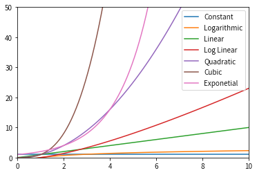
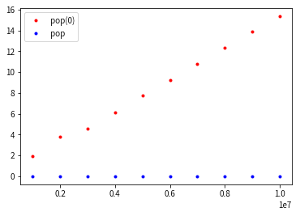
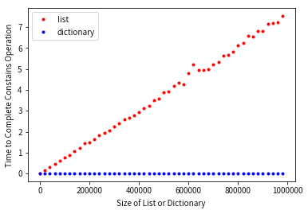

# 算法分析 Algorithm Analysis  
## 2.2 算法分析 

首先，我们写出的代码要具备可读性(readability)。 
  
算法分析(Algorithm Analysis)关注于比较不同算法所消耗的计算资源(computing resources)。  
* the amount of space or memory an algorithm requires to solve the problem  
* "execution time" / "running time": the amount of time they require to execute  
  
基准分析(benchmark analysis)  
在Python中，可以通过`time`模块中`time`函数来返回任意被调用位置的系统当前时钟，在开始和结束的时候两次调用`time`函数来计算该函数的执行时间。  


```python
import time

def sumofN(n):
    start = time.time()
    
    theSum = 0
    for i in range(1, n+1):
        theSum = theSum + i
        
    end = time.time()
    
    return theSum, end-start
```

每次计算前10000个整数的和，执行该函数5次，我们得到：


```python
for i in range(5):
    print("Sum is %d required %10.7f seconds"%sumofN(100000))
```

    Sum is 5000050000 required  0.0108304 seconds
    Sum is 5000050000 required  0.0071776 seconds
    Sum is 5000050000 required  0.0058846 seconds
    Sum is 5000050000 required  0.0059533 seconds
    Sum is 5000050000 required  0.0058603 seconds


```python
for i in range(5):
    print("Sum is %d required %10.7f seconds"%sumofN(10**(i+4)))
```

    Sum is 50005000 required  0.0008841 seconds
    Sum is 5000050000 required  0.0074997 seconds
    Sum is 500000500000 required  0.0753345 seconds
    Sum is 50000005000000 required  0.7656856 seconds
    Sum is 5000000050000000 required  7.7173083 seconds


如果我们使用不同的方式来解决求和问题，利用封闭方程(close equation)$\Sigma^{n}_{i=1}i=\frac{n(n+1)}{2}$代替迭代来计算前n个整数的和，那么：


```python
import time

def sumofN2(n):
    start = time.time()
    
    theSum = n*(n+1)/2
        
    end = time.time()
    
    return theSum, end-start
```


```python
for i in range(5):
    print("Sum is %d required %10.7f seconds"%sumofN2(100000))
```

    Sum is 5000050000 required  0.0000017 seconds
    Sum is 5000050000 required  0.0000017 seconds
    Sum is 5000050000 required  0.0000007 seconds
    Sum is 5000050000 required  0.0000007 seconds
    Sum is 5000050000 required  0.0000010 seconds


比较求和不同数目n个整数所用时间：


```python
for i in range(5):
    print("Sum is %d required %10.7f seconds"%sumofN2(10**(i+4)))
```

    Sum is 50005000 required  0.0000017 seconds
    Sum is 5000050000 required  0.0000010 seconds
    Sum is 500000500000 required  0.0000007 seconds
    Sum is 50000005000000 required  0.0000010 seconds
    Sum is 5000000050000000 required  0.0000017 seconds


可以看到，上面方法的执行时间比之前的任何使用迭代的例子所用时间都少，而且对于不同的求和数目n，所用时间基本相同。因此，可知迭代方案需要做更多的工作，因为一些步骤被重复执行，并且随着迭代次数的增多，程序执行耗时也越长。  
但是基准分析(benchmark analysis)通过计算程序执行的实际用时来衡量算法，但执行时间也取决于其他因素，如机器、编程语言、编译器等，所以我们需要一个独立于机器和编程语言的标准来衡量算法。

## 2.3 Big-O($\mathcal{O}$) Notation  


如果我们把算法的每个操作步骤视为计算的基本单位，这样算法的执行时间可以所需操作步骤数来衡量。  
在前面所述的例子中，计数求和计算中赋值声明的数目是一较好的基本单位，在方程`sumofN`中，赋值声明的总数为1(`theSum=0`)加上$n$(执行`theSum=theSum+i`的次数)，用方程$T$来表示，则$T(n)=1+n$。  
数量级(order of magnitude)方程描述了随$n$值增加，$T(n)$中增长最快的部分，常称作大$O$符号(Big-O notation)，写作$\mathcal{O}(f(n))$。  
  
以下是一些常见数量级函数。 

|f(n)|Name|
|:-:|:-:|
|$1$|Constant|
|$\log$ $n$|Logrithmic|
|$n$|Linear|
|$n$ $\log$ $n$ |Log Linear|
|$n^{2}$|Quadratic|
|$n^{3}$|Cubic|
|$2^{n}$|Exponential|


```python
import numpy as np
import matplotlib.pyplot as plt

n = np.linspace(0.01, 10, 100)

plt.plot(n, 1+0*n, label='Constant')
plt.plot(n, np.log(n), label='Logarithmic')
plt.plot(n, n, label='Linear')
plt.plot(n, n*np.log(n), label='Log Linear')
plt.plot(n, n**2, label='Quadratic')
plt.plot(n, n**3, label='Cubic')
plt.plot(n, 2**n, label='Exponetial')

plt.xlim(0, 10)
plt.ylim(0, 50)

plt.legend(loc='upper right')

plt.show()
```





## 2.4 乱序检测示例  
问题描述：对比组成两个字符串的字母元素是否相同，简单起见，假设两个字符串的长度相同，且都由小写字母组成。

方案一：依次核对


```python
def anagramSolution1(s1,s2):
    alist = list(s2)

    pos1 = 0
    stillOK = True

    while pos1 < len(s1) and stillOK:
        pos2 = 0
        found = False
        while pos2 < len(alist) and not found:
            if s1[pos1] == alist[pos2]:
                found = True
            else:
                pos2 = pos2 + 1

        if found:
            alist[pos2] = None
        else:
            stillOK = False

        pos1 = pos1 + 1

    return stillOK
```

自己写的答案，问题：比较完以后没有替换为空，出现`anagramSolution1('srada', 'arsd')=True`的结果，但是字符串(string)的元素为不可变的，需要转变为列表(list)


```python
def anagramSolution1(s1, s2):
    
    pos1 = 0
    stillOK = True
    
    while pos1 < len(s1) and stillOK:
        
        pos2 = 0
        found = True
        
        while pos2 < len(s2) and found:
            
            if s1[pos1] == s2[pos2]:
                found = False
                stillOK = True
            else:
                found = True
                stillOK = False
                
            pos2 = pos2+1
            
        pos1 = pos1+1
                
    return stillOK
```

每一个包含n个字母的字符串s1都会在列表s2中迭代n次，列表中n个位置中每一个都会被访问一次来配对s1中的字母，总的访问次数为1到n的和：  
$$\sum\limits_{i=1}^{n}i=\frac{n(n+1)}{2}=\frac{1}{2}n^{2}+\frac{1}{2}n$$  
则算法复杂度为$\mathcal{O}(n^2)$

方案二：排序比较


```python
def anagramSolution2(s1,s2):
    alist1 = list(s1)
    alist2 = list(s2)

    alist1.sort()
    alist2.sort()

    pos = 0
    matches = True

    while pos < len(s1) and matches:
        if alist1[pos]==alist2[pos]:
            pos = pos + 1
        else:
            matches = False

    return matches

print(anagramSolution2('abcde','edcba'))
```

排序算法的复杂度为$\mathcal{O}(n^2)$或$\mathcal{O}(n\log n)$

方案三：穷举法/暴力求解(Brute Force)  
将字符串s1中的字母的所以排列可能一一列举出来，与字符串s2比较，其复杂度为$\mathcal{O}(n!)$。

方案四：计数与比较  
统计字符串s1中26个字母出现的次数，并与字符串s2比较


```python
def anagramSolution4(s1,s2):
    c1 = [0]*26
    c2 = [0]*26

    for i in range(len(s1)):
        pos = ord(s1[i])-ord('a')
        c1[pos] = c1[pos] + 1

    for i in range(len(s2)):
        pos = ord(s2[i])-ord('a')
        c2[pos] = c2[pos] + 1

    j = 0
    stillOK = True
    while j<26 and stillOK:
        if c1[j]==c2[j]:
            j = j + 1
        else:
            stillOK = False

    return stillOK

print(anagramSolution4('apple','pleap'))
```

前面的两个迭代统计字母出现的次数的操作步数为n，接下来的迭代比较两个列表，需要26步操作，所以总的操作数为$T(n)=2n+26$，复杂度为$\mathcal{O}(n)$。  
虽然上面方法四有效的节省了计算执行时间，但其是在牺牲了内存空间的基础上实现的。因此，在许多情况下，都需要权衡执行时间与资源消耗。

## 2.5 Python数据结构的性能  
### 列表  
Python的设计者在设计列表数据结构时，考虑到使一些最常见的列表操作操作得以非常快，当然为此他们也牺牲了一些不常见操作的性能。  
列表的常见操作有索引和赋值某索引位置，在Python中，这些操作的的复杂度为$\mathcal{O}(1)$，即不管列表的长度有多长，这些操作的执行时间相同。  
另外一个常见操作为增长列表，有两种途径，其一是利用添加(append)方式，算法复杂度为$\mathcal{O}(1)$，其二是拼接(concatennation)操作，复杂度为$\mathcal{O}(k)$，k为拼接部分的长度。  
示例：产生0到n的列表


```python
# method 1: try a for loop and create the list by concatenation
def test1():
    l = []
    for i in range(1000):
        l = l + [i]

# method 2: use append 
def test2():
    l = []
    for i in range(1000):
        l.append(i)

# method 3: creating the list using list comprehension
def test3():
    l = [i for i in range(1000)]

# method 4: sing the range function wrapped by a call to the list constructor
def test4():
    l = list(range(1000))
```

利用Python中的`timeit`模块来获取每一个函数的执行时间。`timeit`模块便是设计便于Python开发者在一致的环境下和利用在不同平台下尽可能相同的计时机制来做跨平台的的函数执行计时测量。  
利用`timeit`建立`Timer`对象，参数为两个Python语句。第一个参数为想要计时执行时间的Python语句; 第二个参数为运行一次以测试的语句。默认情况下，`timeit`会执行该语句100000次，计算执行时间，可以通过调用`number`来改变语句执行的次数。


```python
import timeit
t1 = timeit.Timer("test1()", "from __main__ import test1")
print("concat ",t1.timeit(number=1000), "milliseconds")
t2 = timeit.Timer("test2()", "from __main__ import test2")
print("append ",t2.timeit(number=1000), "milliseconds")
t3 = timeit.Timer("test3()", "from __main__ import test3")
print("comprehension ",t3.timeit(number=1000), "milliseconds")
t4 = timeit.Timer("test4()", "from __main__ import test4")
print("list range ",t4.timeit(number=1000), "milliseconds")
```

    concat  1.4953298177570105 milliseconds
    append  0.09146081656217575 milliseconds
    comprehension  0.03501279279589653 milliseconds
    list range  0.016382521018385887 milliseconds


在上面的例子中，我们对 test1(), test2() 等的函数调用计时，setup 语句可能看起来很奇怪，所以我们详细说明下。你可能非常熟悉 from ,import 语句，但这通常用在 Python 程序文件的开头。在这种情况下，`from __main__ import test1` 从 `__main__` 命名空间导入到 `timeit` 设置的命名空间中。`timeit` 这么做是因为它想在一个干净的环境中做测试，而不会因为可能有你创建的任何杂变量，以一种不可预见的方式干扰你函数的性能。  
从上面的例子可以看出，添加(append)操作比拼接(concatenation)操作快，列表生成器(list comprehension)比for循环下的添加(append)操作要快（2倍）。  
  
|Operation|Big-O Efficiency|
|:-:|:-:|
|index []|O(1)|
|index assignment|O(1)|
|append|O(1)|
|pop()|O(1)|
|pop(i)|O(n)|
|insert(i,item)|O(n)|
|del operator|O(n)|
|iteration|O(n)|
|contains (in)|O(n)|
|get slice [x:y]|O(k)|
|del slice|O(n)|
|set slice|O(n+k)|
|reverse|O(n)|
|concatenate|O(k)|
|sort|O(n log n)|
|multiply|O(nk)|  
  
我们注意到`pop()`与`pop(i)`的复杂度不一样，这是因为当列表中的一项被移除时，其他项就会向起始端移动一个位置，这样做是为了使索引操作的复杂度维持在$\mathcal{O}(1)$。


```python
popzero = timeit.Timer("x.pop(0)",
                       "from __main__ import x")
popend = timeit.Timer("x.pop()",
                      "from __main__ import x")
```


```python
x = list(range(2000000))
popzero.timeit(number=1000)
```


    3.0251114601269364


```python
x = list(range(2000000))
popend.timeit(number=1000)
```


    0.00011686421930789948


在以上的例子中，首先语句 `from __main__ import x` 允许我们只计算单个 `pop` 语句，获得该操作最精确的测量时间。另外因为 `timer` 重复了 1000 次，该列表每次循环大小都减 1，但是由于初始列表大小为 200万，我们只减少总体大小的 0.05%。  
虽然以上测试显示 pop(0) 比 pop() 慢， 但它并没有证明 pop(0) 的复杂度是 O(n), pop() 的复杂度是 O(1)。要验证它，需要看下面一系列列表大小的调用效果


```python
import timeit
import numpy as np
import matplotlib.pyplot as plt

popzero = timeit.Timer("x.pop(0)",
                "from __main__ import x")
popend = timeit.Timer("x.pop()",
               "from __main__ import x")
print("pop(0)   pop()")

listsize = range(1000000,10000001,1000000)
pt = np.zeros(len(listsize))
pz = np.zeros(len(listsize))

for i in listsize:
    x = list(range(i))
    pt[int(i/1000000-1)] = popend.timeit(number=1000)
    x = list(range(i))
    pz[int(i/1000000-1)] = popzero.timeit(number=1000)
    print("%15.5f, %15.5f" %(pz[int(i/1000000-1)],pt[int(i/1000000-1)]))
```

    pop(0)   pop()
            1.90550,         0.00012
            3.82658,         0.00012
            4.60146,         0.00012
            6.12582,         0.00012
            7.74100,         0.00027
            9.19883,         0.00012
           10.75256,         0.00012
           12.30059,         0.00012
           13.84895,         0.00012
           15.34347,         0.00012


```python
plt.plot(listsize, pz, 'r.', label='pop(0)')
plt.plot(listsize, pt, 'b.', label='pop')

plt.legend(loc='upper left')

plt.show()
```





### 字典  
字典的一些操作和复杂度  
  
|operation|Big-O Efficiency|
|:-:|:-:|
|copy|O(n)|
|get item|O(1)|
|set item|O(1)|
|delete item|O(1)|
|contains (in)|O(1)|
|iteration|O(n)|  
  
在列表(list)操作中，包含(contains)操作的复杂度为$\mathcal{O}(n)$，而在字典(dictionary)中，其复杂度为$\mathcal{O}(1)$。我们通过一个例子来说明一下，创建一个数列列表，任意选择一个数来查看它是否在列表里，列表越长，查看元素是否位于列表内用时越长。  
在字典中重复同样的操作，可以看到查看一个数字是否在字典内相对更快，且不随列表长度增加而增加。


```python
import timeit
import random

for i in range(10000,1000001,20000):
    t = timeit.Timer("random.randrange(%d) in x"%i,
                     "from __main__ import random,x")
    x = list(range(i))
    lst_time = t.timeit(number=1000)
    x = {j:None for j in range(i)}
    d_time = t.timeit(number=1000)
    print("%d,%10.3f,%10.3f" % (i, lst_time, d_time))
```

    10000,     0.089,     0.001
    30000,     0.318,     0.001
    50000,     0.371,     0.001
    70000,     0.535,     0.001
    90000,     0.717,     0.001
    110000,     0.870,     0.001
    130000,     1.000,     0.001
    150000,     1.147,     0.001
    170000,     1.268,     0.001
    190000,     1.738,     0.002
    210000,     2.078,     0.002
    230000,     2.099,     0.001
    250000,     1.831,     0.001
    270000,     1.977,     0.002
    290000,     2.143,     0.002
    310000,     2.266,     0.002
    330000,     2.422,     0.002
    350000,     2.671,     0.002
    370000,     2.774,     0.002
    390000,     2.932,     0.002
    410000,     3.070,     0.002
    430000,     3.293,     0.002
    450000,     3.428,     0.002
    470000,     3.520,     0.002
    490000,     3.689,     0.002
    510000,     3.660,     0.002
    530000,     4.155,     0.002
    550000,     4.038,     0.002
    570000,     4.350,     0.002
    590000,     4.342,     0.002
    610000,     4.705,     0.002
    630000,     4.634,     0.002
    650000,     5.117,     0.002
    670000,     5.160,     0.002
    690000,     5.254,     0.002
    710000,     5.759,     0.002
    730000,     5.754,     0.002
    750000,     5.896,     0.002
    770000,     6.106,     0.002
    790000,     6.485,     0.002
    810000,     6.286,     0.002
    830000,     6.278,     0.002
    850000,     6.542,     0.002
    870000,     6.467,     0.002
    890000,     6.893,     0.002
    910000,     7.062,     0.002
    930000,     7.259,     0.002
    950000,     7.255,     0.002
    970000,     7.564,     0.002
    990000,     7.723,     0.002


```python
import timeit
import random

size = range(1,1000001,20000)
lst_time = np.zeros(len(size))
d_time = np.zeros(len(size))

for i in size:
    t = timeit.Timer("random.randrange(%d) in x"%i,
                     "from __main__ import random,x")
    x = list(range(i))
    lst_time[int(i/20000)] = t.timeit(number=1000)
    x = {j:None for j in range(i)}
    d_time[int(i/20000)] = t.timeit(number=1000)

plt.plot(size, lst_time, 'r.', label='list')
plt.plot(size, d_time, 'b.', label='dictionary')

plt.xlabel('Size of List or Dictionary')
plt.ylabel('Time to Complete Constains Operation')

plt.legend(loc='upper left')

plt.show()
```





```python

```
