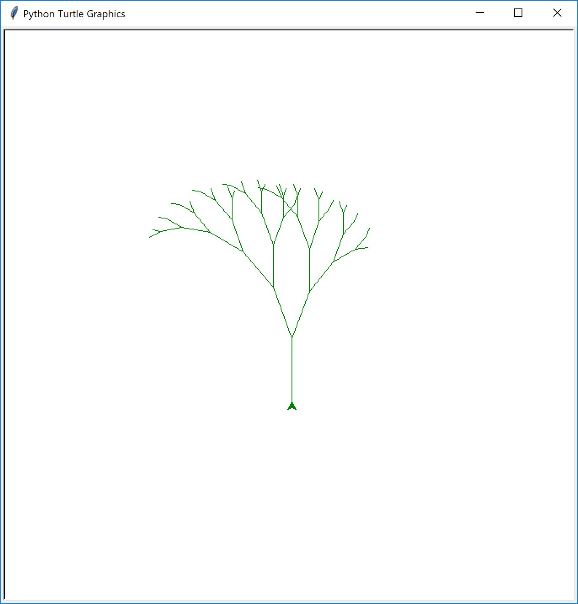

# 递归（Recursion）  
## 4.1 递归（Recursion）
递归是将规模较大的问题层层分割为单个较小的子问题来求解，通常递归包含方程本身。  
## 4.2 数列求和  
比如利用累加器 `theSum` 来计算数列的和：


```python
def listSum(numList):
    theSum = 0
    for i in numList:
        theSum = theSum + i
    return theSum
```


```python
listSum([1, 3, 5, 7, 9])
```


    25


如果不使用 `while` 和 `for` 循环，我们还有什么其他办法计算列表的和呢？我们先用括号表示法重新写一下列表求和：  
$(1+(3+(5+(7+9))))$  
注意最里面的括号内的$(7+9)$我们不借助循环很容易就可以计算出来，实际上，利用下面的一系列式子就可以计算最后的和：  
$\begin{align}
total = (1+(3+(5+(7+9))))& \\ 
total = (1+(3+(5+16)))&  \\
total = (1+(3+21))&  \\
total = (1+24)&  \\
total = 25&
\end{align}$  
在Python中，我们先声明列表 `numList` 为列表第一项 `numList[0]` 和其余项 `numList[1:]` 的和：  
$listSum(numList) = first(numList)+listSum(rest(numList))$  


```python
def listSum(numList):
    # escape clause, checking to see if the list is one element long
    if len(numList) == 1:
        return numList[0]
    # function calls itself!
    else:
        return numList[0] + listSum(numList[1:])
```


```python
listSum([1, 3, 5, 7, 9])
```


    25


注意到，在上面的Python表示中， `return numList[0] + listSum(numList[1:])` 行调用了函数本身，这就是我们称其为递归的原因，每一层递归都在调用一个相对更小的问题，直到问题不能再分割。  
  
当到达最小的子问题时，开始将每一个子问题的解拼接起来，直到问题被解决。下图所示便是 `listsum` 每一层调用的返回：  
  
## 4.3 递归三律  
所有的递归算法都必须满足：  
1. 递归算法必须有一个终止条件。
2. 递归算法必须改变其状态以趋向终止条件。
3. 递归算法必须递归地调用本身。  
下面我们结合 `listSum` 算法说明递归，首先，终止条件是结束递归的条件，其常常是可以直接判断或解决的小问题，在 `listSum` 算法中，终止条件是列表的长度为1。  
然后，变换其状态使算法趋近于终止条件，变换状态即算法正在使用的一些数据被修改，通常代表我们的问题某种程度上在变小。在 `listSum` 算法中，我们的基本数据结构是列表，因为终止条件是列表的长度为1，自然想到趋于终止条件的操作为缩短列表，这正是在 `return numList[0] + listSum(numList[1:])` 行我们所作的。  
  
最后，算法必须调用本身，这在递归中非常明确。  
## 4.4 整数与任意进制字符串间转换  
在之前讨论栈数据结构时，我们介绍了利用栈来实现不同进制间的转换，这里我们尝试利用递归来实现。  
假如我们有一字符串序列对应前10位数， `convString = "0123456789"` ，通过在序列中查找，非常容易就实现小于10的数转变为对应的字符。如果把一个数，例如769拆分成3个小于10的数字，然后转换成字符，那么小于10的数字就是一个相当不错终止条件，这样整个算法可以分解为三个部分：  
1. 将原始数字拆分为一系列单数字。
2. 利用 `lookup` 函数将但数字转变为字符。
3. 将单数字字符拼接得到最后的结果。  
数字拆分最佳候选方案有：除法（division）和减法（subtraction），但是如果用除法的话，我们并不知道减去多少，所以整数除法取余是一个不错的选择，769除以10，得到76余9，首先，余数为小于基数的数字，可以通过 `lookup` 快速地转变为字符，其次，我们得到的商比原来的数字小，且更趋近于终止条件，接下来继续利用整除方法，直到剩下7，它满足终止条件$n<base, base=10$，计算它轻而易举，整个操作如下图所示：  
  


```python
def toStr(n, base):
    convertString = "0123456789ABCDEF"
    # check for the base case where n is less than the base we are converting to
    if n < base:
        return convertString[n]
    # satisfy both the second and third laws–by making the recursive call and by reducing the problem size–using division
    else:
        return toStr(n//base, base) + convertString[n%base]
```


```python
toStr(769, 10)
```


    '769'


跟踪算法将数字10转变为2进制数的过程，如下图，看起来似乎数字是反序的，但是算法并灭有问题，因为我们首先从 `return toStr(n//base, base) + convertString[n%base]` 行开始递归，然后将余数的转换字符形式拼接，如果递归返回 `convertString` 查找和 `toStr` 调用，结果字符串就成反向的了！通过延迟拼接操作直到递归的调用返回，我们得到了正确的次序，这让我们想起了之前所讨论的栈的结构。  
  
## 4.5 栈帧：递归表示  
除了拼接通过递归调用 `toStr` 的返回和 `convertString` 的字符，我们还可以修改算法将字符在递归调用之前添加到栈中：


```python
from pythonds.basic.stack import Stack

rStack = Stack()

def toStr(n, base):
    convertString = "0123456789ABCDEF"
    while n > 0:
        if n < base:
            rStack.push(convertString[n])
        else:
            rStack.push(convertString[n%base])
        n = n // base
        
    res = ""
    while not rStack.isEmpty():
        res = res + str(rStack.pop())
        
    return res
```


```python
toStr(1453, 16)
```


    '5AD'


我们每一次调用 `toStr` ，就会将一个字母添加到栈中，在上面的例子中，经过4次调用 `toStr` 栈中的元素排列为：  
  
注意之后就可以依次地从栈中弹出字母并拼接到一起，得到“1010”。在之前的例子中，我们看到了Python如何表示递归函数的调用——当Python调用一个函数时，会分配一个栈来处理函数的局部变量，当函数返回时，返回的值留在栈的顶端等待调用函数访问，返回声明的调用栈如下图所示：  
  
注意调用 `toStr(2//2, 2)` 会在栈中留下返回值 `"1"` ，该返回值之后会用于 `"1" + convertString[2%2]` 表示的函数调用位置 `toStr(1,2)` ，留下字符串 `"10"` 在栈顶。这样，Python调用栈替代了上面表示中所使用的栈。在列表求和例子中，栈中的返回值替代了累加变量。  
栈帧同样提供了函数所使用变量的概览，即使我们不停地调用相同的函数，每一次都会产生函数局部变量的概览。  
## 4.6 递归可视化  
### 4.6.1分形树（Fractal Tree）  
现在，我们利用递归来作一些有趣的图案，使用Python中的 `turtle` 绘图标准模块，顾名思义，该模块会创建一个乌龟，来回左右移动，乌龟的尾巴蘸墨用来画线，可以选择线宽和颜色。  
下面我们用它来画一个递归的螺旋线，导入 `turtle` 模块后，首先创建一个乌龟，同时也创建了一个绘图窗口。接下来定义 `drawSpiral` 函数，终止条件是所要画的线长度，参数 `len` 减小到0，如果线的长度大于0，继续向前走 `len` 的长度然后右转90度，递归步骤是在减小长度的同时调用 `drawSpiral` 函数，代码结束的 `myWin.exitonclicl()` 是窗口的交互操作——点击窗口内部


```python
import turtle

myTurtle = turtle.Turtle()
myWin = turtle.Screen()

def drawSpiral(myTurtle, lineLen):
    if lineLen > 0:
        myTurtle.forward(lineLen)
        myTurtle.right(90)
        drawSpiral(myTurtle, lineLen-5)

drawSpiral(myTurtle, 100)
myWin.exitonclick()
```

接下来，我们来看一个分形（fractal）的例子，分形是数学上的概念，一个几何形状，可以分成数个部分，且每一部分都（至少近似地）是整体缩小后的形状，这很类似于递归的概念，自然界中有许多列子，如海岸线，雪花，山峰和树枝，下面我们就利用程序来产生一个分行树。由分形的概念我们知道分形树的枝杈即使在很小范围内也拥有整个树的形状和特性，一个主干左右分叉为两个枝干，枝干再左右分叉，这样在枝干的顶端递归分叉，用程序来描述即：


```python
def tree(branchLen, t):
    if branchLen > 5:
        t.forward(branchLen)
        t.right(20)
        tree(branchLen-15, t)
        t.left(40)
        tree(branchLen-10, t)
        t.right(20)
        t.backward(branchLen)
        
def main():
    t = turtle.Turtle()
    myWin = turtle.Screen()
    t.left(90)
    t.up()
    t.backward(100)
    t.down()
    t.color("green")
    tree(75, t)
    myWin.exitonclick()
    
mian()
```

在行5和行7，我们分别做了递归调用，行5的递归调用让乌龟向右转20度，得到之前所述的右枝杈，行7再次调用递归，乌龟向左转40度，因为之前已经向右转了20度，每一次调用 `tree` 都会将 `branchLen` 减去一部分，这样分形树杈就会越来越小，而行2的 `if` 判断 `branchLen` 长度为终止条件。  


### 4.6.2 谢尔宾斯基三角形（Sierpinski Triangle）   
另外一个自相似的分形实例是谢尔宾斯基三角形，如下图所示，该图形显示了树状递归算法。它的绘制方法为：  
1. 取一个实心的三角形。（多数使用等边三角形）
2. 沿三边中点的连线，将它分成四个小三角形。
3. 去掉中间的那一个小三角形。
4. 对其馀三个小三角形重复1。  
  
  
用计算机程序绘制谢尔宾斯基三角形之前，我们先定义一个概念——分形的“度（degree）”，每做一次递归，分形的度就会减去1直到其为0，然后停止递归，代码示例如下：


```python
import turtle

def drawTriangle(points, color, myTurtle):
    myTurtle.fillcolor(color)
    myTurtle.up()
    myTurtle.goto(points[0][0], points[0][1])
    myTurtle.down()
    myTurtle.begin_fill()
    myTurtle.goto(points[1][0], points[1][1])
    myTurtle.goto(points[2][0], points[2][1])
    myTurtle.goto(points[0][0], points[0][1])
    myTurtle.end_fill()
    
def getMid(p1, p2):
    return ((p1[0]+p2[0])/2, (p1[1]+p2[1])/2)

def sierpinski(points, degree, myTurtle):
    colormap = ['blue', 'red', 'green', 'white', 'yellow', 'violet', 'orange']
    drawTriangle(points, colormap[degree], myTurtle)
    if degree > 0:
        sierpinski([points[0], getMid(points[0], points[1]), getMid(points[0], points[2])], degree-1, myTurtle)
        sierpinski([points[1], getMid(points[0], points[1]), getMid(points[1], points[2])], degree-1, myTurtle)
        sierpinski([points[2], getMid(points[2], points[1]), getMid(points[0], points[2])], degree-1, myTurtle)
        
def main():
    myTurtle = turtle.Turtle()
    myWin = turtle.Screen()
    myPoints = [[-100, -50], [0, 100], [100, -50]]
    sierpinski(myPoints, 3, myTurtle)
    myWin.exitonclick()
    
main()
```

首先， `sierpinski` 画最外面的三角形，然后有3个递归调用，每一个角上的新三角形都与原来三角形的边上中点相关联，依左下、上、右下的顺序依次画出，如下图所示，执行的函数为黑线，不执行的函数为灰色， `sierpinski` 递归的调用，首先画出一系列坐下的三角形，直到最小的一个左下三角形，然后上面最小三角形，然后是右下，再然后是上面次小，上面次小内的上面最小，上面次小内的左下最小，上面次小内的右下最小，右下次小，右下次小内的右下最小，右下次小内的上面最小，右上次小内的左下最小，依次类推。  
  
## 4.7 复杂递归问题  
在上面我们介绍了一些简单的示例，接下来我们看一些复杂的问题，如果用迭代解决的话，分厂困难，然而利用递归，可以非常简洁地解决它。最后我们介绍一些乍看起来能用递归解决实际却行不通的例子。  
### 4.7.1 汉诺塔难题（Tower of Hanoi）  
汉诺塔难题是法国数学家Edouard Lucas于1883年提出，源于印度的传说——元始之初，有三根柱子和64个金盘，每一个金盘都比其下面的金盘小一号，祭司负责将金盘移动到另外一根柱子上，但需遵循两项规则：一次只能移动一个盘子并且大盘子不能位于小盘子之上，祭司夜以继日的移动这些盘子，当他完成这项工作时，世界就会毁灭。  
这有些耸人听闻，但仔细一想，把所有64个盘子按照规则移动到另外一根柱子上总共需要$2^{64}-1=18,446,744,073,709,551,615$步，如果一秒移动一次的话，需要18,446,744,073,709,551,615秒，即584,942,417,355年！  
  
我们如何利用递归来解决这个问题呢？我们的终止条件又是什么呢？让我们自底而上地考虑，如果只有1个盘子，我们轻而易举地就能办到，2个盘子也不复杂，3个亦然，基本思路就是：假设有 A、B、C 三个塔，A 塔有N块盘，目标是把这些盘全部移到 C 塔。那么  
1. 先把 A 塔顶部的N-1块盘移动到B塔；
2. 再把 A 塔剩下的大盘移到 C；
3. 最后把 B 塔的N−1块盘移到 C。
  
我们的终止条件是只有一个盘子，此外，在第1和3步中塔的高度会降低。


```python
def moveTower(height, fromPole, toPole, withPole):
    if height >= 1:
        # move all but the bottom disk on the initial tower to an intermediate pole
        moveTower(height-1, fromPole, withPole, toPole)
        # simply moves the bottom disk to its final resting place
        moveDisk(fromPole, toPole)
        # move the tower from the intermediate pole to the top of the largest disk
        moveTower(height-1, withPole, toPole, fromPole)
        
def moveDisk(fp, tp):
    print("moving disk from", fp, "to", tp)
```


```python
moveTower(3, 'A', 'B', 'C')
```

    moving disk from A to B
    moving disk from A to C
    moving disk from B to C
    moving disk from A to B
    moving disk from C to A
    moving disk from C to B
    moving disk from A to B


在上面的表示中，行4的递归调用将A柱子上除了最下面的盘子外所有的盘子移到中间的B柱子上，行6将最下面的盘子移到最终的C柱子上，行8的递归调用将剩下的盘子从中间的B柱子移动到最终的C柱子上。终止条件是判断塔的高度是否为0，该情况下， `moveTower` 函数仅返回 `moveDisk` 的结果，而 `moveDisk` 打印出最简单情况的结果，即仅有一个盘子，将其从A柱子上移动到最终的C柱子上。如果查看移动过程中的数据结构的话，可以利用三个栈对应每个柱子来跟踪每一个盘子的移动情况。  
### 4.7.2 迷宫探险  
希腊神话中Theseus进入迷宫杀掉牛头人，Theseus利用一个阵线球记录来时的路，帮他在杀掉怪物后找到返回的路。假设我们的乌龟置身于迷宫之间，如何找到出去的路呢？  

简而言之，假设迷宫被分为一个个方形区域，迷宫的每个方形区域或开放或为墙壁，如果乌龟撞墙了，那么就会尝试其他的方向，乌龟需要一系列的步骤来发现迷宫的出口：  
* 从开始位置一路向北，每次移动一个方块区域，让后递归前进；
* 向北行进行不通，就向南递归前进；
* 向南行不通就向西走一步，递归前进；
* 向北、南和西都碰壁的话，向东走一步，递归前进；
* 所有方向都行不通的话，说明迷宫没有出口。  

听起来很简单，但是有一些细节需要讨论，如果我们第一步向北行进，接下来会一直向北步进，如果碰壁，接下来就会尝试向南步进，但是就会路过我们的起点，很可能会陷入无尽的循环，所以需要标计曾经走过的地方，假设我们有一包碎面包屑，走过的地方都会留下面包屑的痕迹，不再走它。 
  
终止条件为：  
1. 乌龟碰壁，即方块为不可透过的墙壁所占；
2. 乌龟遇到已经走过的路，避免重复在走一次或者陷入循环；
3. 发现没有被墙壁占据的区域，找到出口；
4. 在四个方向上都没有找到出口。  
首先利用 `turtle` 模块建立迷宫对象：  
* `__init__` 读取代表迷宫的数据文件，初始化迷宫的内部表示，以及定位乌龟的起始点；
* `drawMaze` 在屏幕窗口画出迷宫；
* `updatePosition` 更新迷宫的内部表示和改变乌龟在窗口的位置；
* `isExit` 检查当前位置是否为迷宫的出口。  
  
同时 `Maze` 类也加载了索引操作 `[]` 以便于我们查看任意方块的状态。


```python
def searchFrom(maze, startRow, startColumn):
    maze.updatePosition(startRow, startColumn)
    # Check for base cases:
    # 1. We have run into an obstacle, return false
    if maze[startRow][startColumn] == OBSTACLE:
        return False
    # 2. We have found a square that has already been explored
    if maze[startRow][startColumn] == TRIED:
        return False
    # 3. Success, an outside edge not occupied by an obstacle
    if maze.isExit(startRow, startColumn):
        maze.updatePosition(startRow, startColumn, PART_OF_PATH)
        return True
    maze.updatePosition(startRow, startColumn, TRIED)
    
    # Otherwise, use logical short circuiting to try each
    # direction in turn (if needed)
    found = searchFrom(maze, startRow-1, startColumn) or \
    searchFrom(maze, startRow+1, startColumn) or \
    searchFrom(maze, startRow, startColumn-1) or \
    searchFrom(maze, startRow, startColumn+1)
    
    if found:
        maze.updatePosition(startRow, startColumn, PART_OF_PATH)
    else:
        maze.updatePosition(startRow, startColumn, DEAD_END)
    return found
```

下面的代码框中是 `Maze` 类的代码，`__init__` 方法以文件名作为参数，该文件用"+"和空格分别代表墙壁和开放空间，"S"代表乌龟的位置，下面是迷宫的数据文件，其内部表示为列表的列表，实例变量（instance variable）迷宫列表 `mazeList` 的每一行也是一个列表，子列表中是代表个元素的符号。  
```
++++++++++++++++++++++
+   +   ++ ++     +
+ +   +       +++ + ++
+ + +  ++  ++++   + ++
+++ ++++++    +++ +  +
+          ++  ++    +
+++++ ++++++   +++++ +
+     +   +++++++  + +
+ +++++++      S +   +
+                + +++
++++++++++++++++++ +++
```


```python
mazeList = [['+','+','+','+','+','+','+','+','+','+','+'], 
            ['+',' ',' ',' ',' ',' ',' ','+',' ',' ',' '],
            ['+',' ','+',' ','+','+',' ','+',' ','+','+'],
            ['+',' ','+',' ',' ',' ',' ','+',' ','+','+'],
            ['+','+','+',' ','+','+',' ','+',' ',' ','+'],
            ['+',' ',' ',' ','+','+',' ',' ',' ',' ','+'],
            ['+','+','+','+','+','+','+','+','+',' ','+'],
            ['+',' ',' ',' ','+','+',' ','S','+',' ','+'],
            ['+',' ','+','+',' ',' ','+',' ',' ',' ','+'],
            ['+',' ',' ',' ',' ',' ','+',' ','+','+','+'],
            ['+','+','+','+','+','+','+',' ','+','+','+']]
```


```python
mazeList
```


    [['+', '+', '+', '+', '+', '+', '+', '+', '+', '+', '+'],
     ['+', ' ', ' ', ' ', ' ', ' ', ' ', '+', ' ', ' ', ' '],
     ['+', ' ', '+', ' ', '+', '+', ' ', '+', ' ', '+', '+'],
     ['+', ' ', '+', ' ', ' ', ' ', ' ', '+', ' ', '+', '+'],
     ['+', '+', '+', ' ', '+', '+', ' ', '+', ' ', ' ', '+'],
     ['+', ' ', ' ', ' ', '+', '+', ' ', ' ', ' ', ' ', '+'],
     ['+', '+', '+', '+', '+', '+', '+', '+', '+', ' ', '+'],
     ['+', ' ', ' ', ' ', '+', '+', ' ', 'S', '+', ' ', '+'],
     ['+', ' ', '+', '+', ' ', ' ', '+', ' ', ' ', ' ', '+'],
     ['+', ' ', ' ', ' ', ' ', ' ', '+', ' ', '+', '+', '+'],
     ['+', '+', '+', '+', '+', '+', '+', ' ', '+', '+', '+']]


`drawMaze` 会利用以上的内部表示来画出迷宫在屏幕上的初始图像。  
`updatePosition` 方法利用相同的内部表示来查看乌龟是否碰到了墙壁，更新乌龟所走过的方块或者为死胡同的方块为"."和“-” ，它还借助了两个辅助方法 `moveTurtle` 和 `dropBreadCrumb` 来更新屏幕的显示。  
最后， `isEmpty` 方法利用乌龟的当前位置来判断其是否走出迷宫，出口的条件是当乌龟位于迷宫的边缘，即最外面的行或列（行或列为零或最大）。


```python
class Maze:
    def __init__(self, mazeFileName):
        rowsInMaze = 0
        columnInMaze = 0
        self.mazeList = []
        mazeFile = open(mazeFileName, 'r')
        rowsInMaze = 0
        for line in mazeFile:
            rowList = []
            col = 0
            for ch in line[:-1]:
                rowList.append(ch)
                if ch == 'S':
                    self.startRow = rowsInMaze
                    self.startCol = col
                col = col + 1
            rowsInMaze = rowsInMaze + 1
            self.mazeList.append(rowList)
            columnsInMaze = len(rowList)
            
        self.rowsInMaze = rowsInMaze
        self.columnsInMaze = columnsInMaze
        self.xTranslate = -columnsInMaze/2
        self.yTranslate = rowsInMaze/2
        self.t = turtle.Turtle()
        self.t.shape('turtle')
        self.wn = turtle.Screen()
        self.wn.setworldcoordinates(-(columnsInMaze-1)/2-.5, 
                            -(rowsInMaze-1)/2-.5, 
                            (columnsInMaze-1)/2+.5, 
                            (rowsInMaze-1)/2+.5)
```


```python
def drawMaze(self):
    self.t.speed(10)
    self.wn.tracer(0)
    for y in range(self.rowsInMaze):
        for x in range(self.columnsInMaze):
             if self.mazeList[y][x] == OBSTACLE:
                self.drawCenteredBox(x+self.xTranslate, 
                                    -y+self.yTranslate, 
                                    'tan')
    self.t.color('black')
    self.t.fillcolor('blue')
    self.wn.update()
    self.wn.tracer(1)
    
def drawCenteredBox(self, x, y, color):
    self.t.up()
    self.t.goto(x-.5, y-.5)
    self.t.color('black', color)
    self.t.setheading(90)
    self.t.down()
    self.t.begin_fill()
    for i in range(4):
        self.t.forward(1)
        self.t.right(90)
    self.t.end_fill()
    
def moveTurtle(self, x, y):
    self.t.up()
    self.t.setheading(self.t.towards(x+self.xTranslate, -y+self.yTranslate))
    self.t.goto(x+self.xTranslate, -y+self.yTranslate)
    
def dropBreadCrumb(self, color):
    self.t.dot(color)
    
def udatePosition(self, row, col, val=None):
    if val:
        self.mazeList[row][col] = val
        self.moveTurtle(col, row)
        
    if val == PART_OF_PATH:
        color = 'green'
    elif val == OBSTACLE:
        color = 'red'
    elif val == TRIED:
        color = 'black'
    elif val == DEAD_END:
        color = 'red'
    else:
        color = None
        
    if color:
        self.dropBreadCrumb(color)
```


```python
def isExit(self, row, col):
    return (row == 0 or 
           row == self.rowsInMaze-1 or 
           col == 0 or 
           col ==self.columnsInMaze-1)

def __getitem__(self, idx):
    return self.mazeList[idx]
```

maze2.txt
```
++++++++++++++++++++++
+   +   ++ ++        +
      +     ++++++++++
+ +    ++  ++++ +++ ++
+ +   + + ++    +++  +
+          ++  ++  + +
+++++ + +      ++  + +
+++++ +++  + +  ++   +
+          + + S+ +  +
+++++ +  + + +     + +
++++++++++++++++++++++
```


```python
import turtle

PART_OF_PATH = 'O'
TRIED = '.'
OBSTACLE = '+'
DEAD_END = '-'

class Maze:
    def __init__(self, mazeFileName):
        rowsInMaze = 0
        columnInMaze = 0
        self.mazeList = []
        mazeFile = open(mazeFileName, 'r')
        rowsInMaze = 0
        for line in mazeFile:
            rowList = []
            col = 0
            for ch in line[:-1]:
                rowList.append(ch)
                if ch == 'S':
                    self.startRow = rowsInMaze
                    self.startCol = col
                col = col + 1
            rowsInMaze = rowsInMaze + 1
            self.mazeList.append(rowList)
            columnsInMaze = len(rowList)
            
        self.rowsInMaze = rowsInMaze
        self.columnsInMaze = columnsInMaze
        self.xTranslate = -columnsInMaze/2
        self.yTranslate = rowsInMaze/2
        self.t = turtle.Turtle()
        self.t.shape('turtle')
        self.wn = turtle.Screen()
        self.wn.setworldcoordinates(-(columnsInMaze-1)/2-.5, 
                            -(rowsInMaze-1)/2-.5, 
                            (columnsInMaze-1)/2+.5, 
                            (rowsInMaze-1)/2+.5)
        
    def drawMaze(self):
        self.t.speed(10)
        self.wn.tracer(0)
        for y in range(self.rowsInMaze):
            for x in range(self.columnsInMaze):
                if self.mazeList[y][x] == OBSTACLE:
                    self.drawCenteredBox(x+self.xTranslate, 
                                        -y+self.yTranslate, 
                                        'tan')
        self.t.color('black')
        self.t.fillcolor('blue')
        self.wn.update()
        self.wn.tracer(1)
    
    def drawCenteredBox(self, x, y, color):
        self.t.up()
        self.t.goto(x-.5, y-.5)
        self.t.color('black', color)
        self.t.setheading(90)
        self.t.down()
        self.t.begin_fill()
        for i in range(4):
            self.t.forward(1)
            self.t.right(90)
        self.t.end_fill()
    
    def moveTurtle(self, x, y):
        self.t.up()
        self.t.setheading(self.t.towards(x+self.xTranslate, -y+self.yTranslate))
        self.t.goto(x+self.xTranslate, -y+self.yTranslate)
    
    def dropBreadCrumb(self, color):
        self.t.dot(10, color)
    
    def updatePosition(self, row, col, val=None):
        if val:
            self.mazeList[row][col] = val
            self.moveTurtle(col, row)
        
        if val == PART_OF_PATH:
            color = 'green'
        elif val == OBSTACLE:
            color = 'red'
        elif val == TRIED:
            color = 'black'
        elif val == DEAD_END:
            color = 'red'
        else:
            color = None
        
        if color:
            self.dropBreadCrumb(color)
            
    def isExit(self, row, col):
        return (row == 0 or 
               row == self.rowsInMaze-1 or 
               col == 0 or 
               col ==self.columnsInMaze-1)

    def __getitem__(self, idx):
        return self.mazeList[idx]
    
def searchFrom(maze, startRow, startColumn):
    maze.updatePosition(startRow, startColumn)
    # Check for base cases:
    # 1. We have run into an obstacle, return false
    if maze[startRow][startColumn] == OBSTACLE:
        return False
    # 2. We have found a square that has already been explored
    if maze[startRow][startColumn] == TRIED:
        return False
    # 3. Success, an outside edge not occupied by an obstacle
    if maze.isExit(startRow, startColumn):
        maze.updatePosition(startRow, startColumn, PART_OF_PATH)
        return True
    maze.updatePosition(startRow, startColumn, TRIED)
    
    # Otherwise, use logical short circuiting to try each
    # direction in turn (if needed)
    found = searchFrom(maze, startRow-1, startColumn) or \
    searchFrom(maze, startRow+1, startColumn) or \
    searchFrom(maze, startRow, startColumn-1) or \
    searchFrom(maze, startRow, startColumn+1)
    
    if found:
        maze.updatePosition(startRow, startColumn, PART_OF_PATH)
    else:
        maze.updatePosition(startRow, startColumn, DEAD_END)
    return found

myMaze = Maze('maze2.txt')
myMaze.drawMaze()
myMaze.updatePosition(myMaze.startRow,myMaze.startCol)

searchFrom(myMaze, myMaze.startRow, myMaze.startCol)
```

### 4.7.3 动态规划（Dynamic Programming）  
许多计算机程序设计用来作优化，例如发现两点之间的最短路径，拟合一系列点以及找出一系列满足条件的最小值。计算机科学中有很多策略来解决这些问题，本书的目的是向读者展示一系列不同的解决策略，动态规划（Dynamic Programming）即是解决以上优化问题的一种可选策略。  
优化问题（optimization problem）最经典的例子便是找零问题，即一个自动贩卖机生产商想要使每笔交易的找零用尽可能少的硬币。假如一位顾客投进1元消费了37分，最少找回他多少硬币呢？答案是6个：2个25分，1个10分，3个1分。策略是首先用尽可能多的最大额硬币，然后使用稍小一点面额的硬币，这即是所谓的贪婪算法（greedy method），因为我们一开始就尝试解决问题的最大的一部分。  
贪婪算法在使用1，5，10和25分面额硬币的国家奏效，但是某些国家除此之外可能还会有21分的硬币，这个时候贪婪算法就毫无办法了，它依然会给出最少6个硬币的回答，但显然最佳答案是3个21分的硬币。  
下面来看利用递归如何解决这个问题，如果等额兑换，就需要一个硬币，如果没有相符的面值，会有好几个选择，符合我们要求的是硬币总数量最少的组合，硬币的数量可依下面来计算：  
$
numCoins=min \left\{
\begin{array}{l}
1+numCoins(originalamount-1)\\
1+numCoins(originalamount-5)\\
1+numCoins(originalamount-10)\\
1+numCoins(originalamount-25)\\
\end{array}\right.
$  
用下面的代码实现上述算法，行3为终止条件：用1个基本的面额找零。如果没有等额的基本面额硬币，利用递归调用尝试不同的硬币面额来使找零的数量最小，行6即如何利用列表生成器来过滤小于当前找零值的硬币列表。行7的递归调用会以选中的基本面额值使找零的总数逐渐减少，同时使找零硬币总数加1。


```python
def recMC(coinValueList, change):
    minCoins = change
    if change in coinValueList:
        return 1
    else:
        for i in [c for c in coinValueList if c <= change]:
            numCoins = 1 + recMC(coinValueList, change-i)
            if numCoins < minCoins:
                minCoins = numCoins
    return minCoins
```


```python
recMC([1, 5, 10, 25], 63)
```


    6


上面的代码也存在一些问题，即非常的低效，实际上，他利用了67，716，925次递归调用来寻找63分用4个基本面额硬币找零的问题！要理解这个方法的致命缺陷，可以参看下图列出的找零26分的377个函数调用一小部分。  
  
途中的每一个结点都会调用一次 `recMC` ，结点中的数代表我们每次需要计算的找零值，箭头旁的数为硬币面额，从图中可以看出，计算中有很多重复的地方，例如，程序至少计算了3次如何找零15分，每一次计算找零15分都需要52次函数调用，这样就会白费很多时间和精力。  
解决的办法就是保存之前的一些计算结果，一个简单的方法是将寻找到的最小找零结果保存到一张表中，在计算新的最小值时，先在表中检查一下。修改后的代码如下：


```python
def recDC(coinValueList, change, knownResults):
    minCoins = change
    if change in coinValueList:
        knownResults[change] = 1
        return 1
    elif knownResults[change] > 0:
        return knownResults[change]
    else:
        for i in [c for c in coinValueList if c <= change]:
            numCoins = 1 + recDC(coinValueList, change-i, knownResults)
            if numCoins < minCoins:
                minCoins = numCoins
                knownResults[change] = minCoins
    return minCoins
```


```python
recDC([1, 5, 10, 25], 63, [0]*64)
```


    6


注意在第6行，我们增加了检测我们的表中是否含有已经确定的找零最小值，如果没有，接下来递归调用计算，然后得到的结果存到表中。修改后的算法找零63分减小到221次递归调用！  
实际上，以上我们所做的并不是动态规划而是利用所谓的“记忆化（memoization）”技术，或称“缓存（caching）”来提高程序的运行效率。  
真正的动态规划算法会找出解决问题的更多系统途径，例如上面的动态规划解法是从1分找零开始，系统地找到所要的答案，这保证了我们在每一步都能知道任意一笔找零的硬币数。  
下面以找零11分为例来看程序是如何填充表的。先从1分开始，唯一的答案就是1个硬币，下一行是1分和2分的最小硬币数，第五行有些不一样了，有两种情况需要考虑，5个一分或者一个5分，哪一个更好呢？表中的结果是4分钱需要4个，再加1分等于5分，或者看成0分加一个5分等于1个硬币。当然1个硬币数量更少，所以表中存下1。  
  
快速的考虑一下11分的情况：  
1. 1分加上找零11-1=10分的最少硬币数1
2. 5分加上找零11-5=6分的最少硬币数2
3. 10分加上找零11-10=1分的最少硬币数1  
  
三个选项给出了找零11分的最终结果是2个硬币。  
  
下面是解决找零问题的动态规划算法：


```python
def dpMakeChange(coinValueList, change, minCoin):
    for cents in range(change+1):
        coinCount = cents
        for j in [c for c in coinValueList if c <= cents]:
            if minCoins[cents-j]+1 < coinCount:
                coinCount = minCoins[cents-j]+1
        minCoins[cents] = coinCount
    return minCoins[change]
```

`dpMakeChange` 有三个参数：可用硬币面额列表，找零额和各金额的找零最少硬币数列表，程序结束时， `minCoin` 里面包含从0到 `change` 所有金额的找零硬币数。  
注意到 `dpMakeChange` 并不是递归函数，即使我们一开始利用递归解决该问题。这让我们意识到一个问题可以用递归解决，但递归并不一定是最有效的解法。函数中起主要作用的是从第4行开始的循环，在该循环中，我们考虑找零所有可能的硬币数，记下总数最少的一个存到 `minCoins` 列表中。  
尽管找零算法能够很好的告诉我们所需硬币的最少数量，但是我们无法知道硬币的组合，我们可以利用记忆每一次输入 `minCoins` 时的最后一个硬币来扩展 `dpMakeChange` 以追迹所有使用的硬币。如果知道最后一个，减去它就能知道之前存入列表的，直到最开始。  
下面即是修改以后科技追迹所用硬币组合的 `dpMakeChange` 算法，通过函数 `printCoins` 反回表中，打印出所用的硬币面额。这就可以解决上面提到的如果一个国家试用21分面额硬币时所面临的困境了，`main` 函数的前两行创建基本面额硬币的列表，接下来，创建需要存储结果的列表，注意打印出来的硬币组合是直接来自于 `coinsUsed` 数组，第一个调用找零63分打印21分，然后找零63-21=42分打印21分，最后21分，结果给出3个21分的组合。


```python
def dpMakeChange(coinValueList, change, minCoins, coinsUsed):
    for cents in range(change+1):
        coinCount = cents
        newCoin = 1
        for j in [c for c in coinValueList if c <= cents]:
            if minCoins[cents-j]+1 < coinCount:
                coinCount = minCoins[cents-j]+1
                newCoin = j
        minCoins[cents] = coinCount
        coinsUsed[cents] = newCoin
    return minCoins[change]

def printCoins(coinsUsed,change):
    '''
    function printCoins that walks backward through the table to print out the value of each coin used
    '''
    coin = change
    while coin > 0:
        thisCoin = coinsUsed[coin]
        print(thisCoin)
        coin = coin - thisCoin

def main():
    # set the amount to be converted and create the list of coins used
    amnt = 63
    clist = [1,5,10,21,25]
    # a list of the coins used to make change
    coinsUsed = [0]*(amnt+1)
    # the minimum number of coins used to make change for the amount corresponding to the position in the list
    coinCount = [0]*(amnt+1)

    print("Making change for",amnt,"requires")
    print(dpMakeChange(clist,amnt,coinCount,coinsUsed),"coins")
    print("They are:")
    printCoins(coinsUsed,amnt)
    print("The used list is as follows:")
    print(coinsUsed)

main()
```

    Making change for 63 requires
    3 coins
    They are:
    21
    21
    21
    The used list is as follows:
    [1, 1, 1, 1, 1, 5, 1, 1, 1, 1, 10, 1, 1, 1, 1, 5, 1, 1, 1, 1, 10, 21, 1, 1, 1, 25, 1, 1, 1, 1, 5, 10, 1, 1, 1, 10, 1, 1, 1, 1, 5, 10, 21, 1, 1, 10, 21, 1, 1, 1, 25, 1, 10, 1, 1, 5, 10, 1, 1, 1, 10, 1, 10, 21]


## 4.8 总结  
* 所有的递归算法必须有终止条件。
* 递归算法必须改变其状态以趋向终止条件。
* 递归算法必须递归地调用本身。
* 递归在一些情况下可以代替循环。
* 递归算法通常自然而然地映射到所需解决问题的表现形式上。
* 递归并不一定是最佳答案，有时递归解法可能比替代方案消耗更多的计算资源。


```python

```
